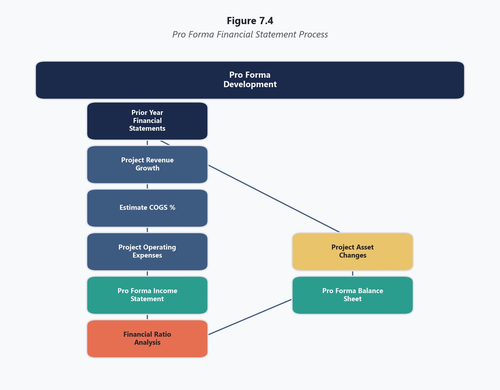
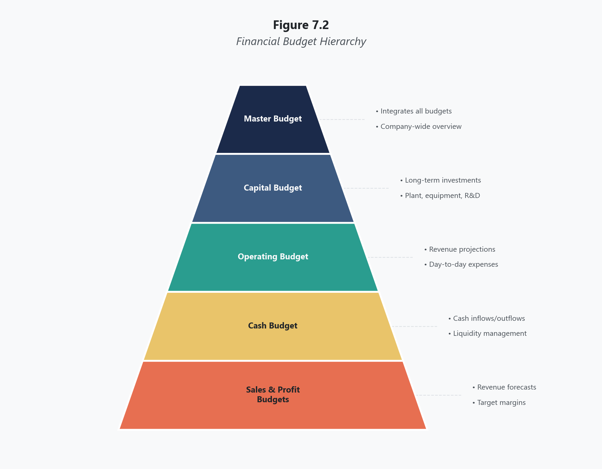
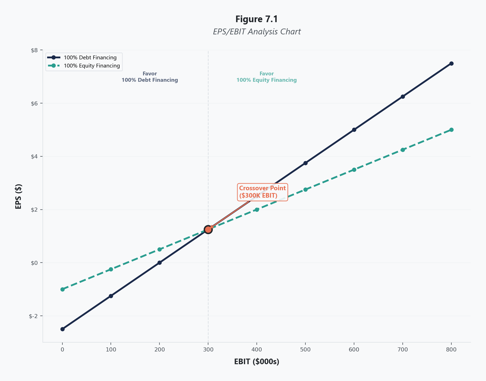
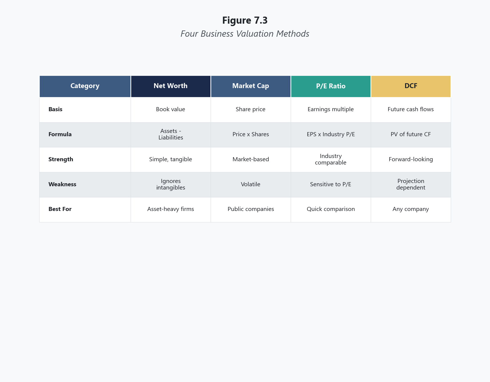
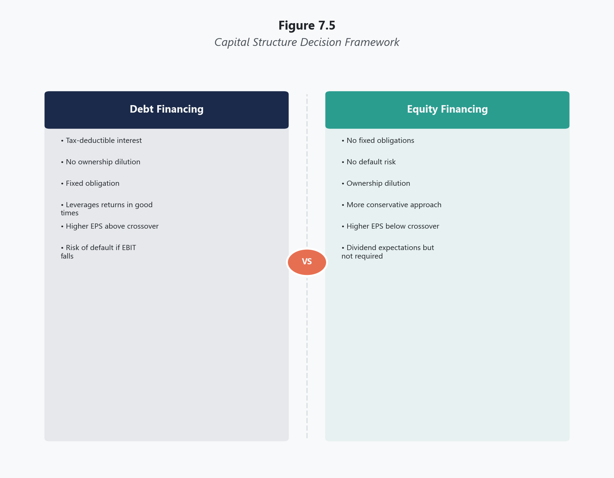
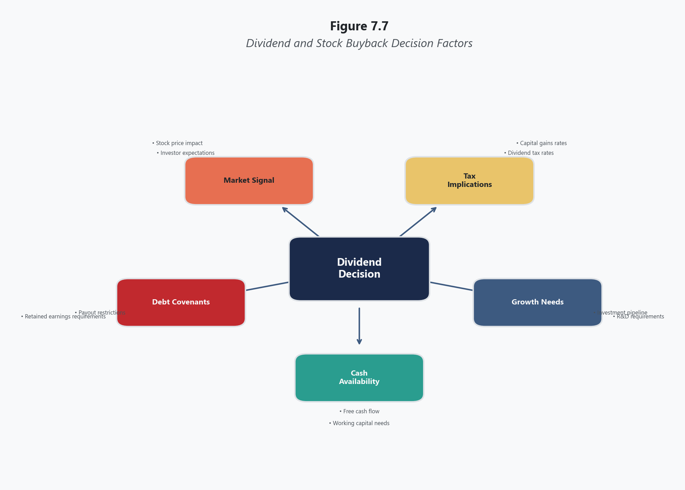
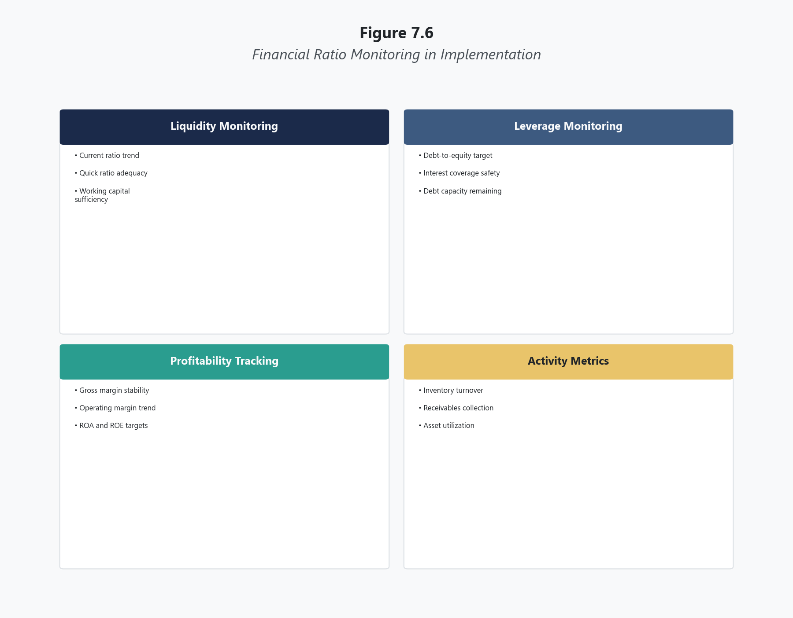
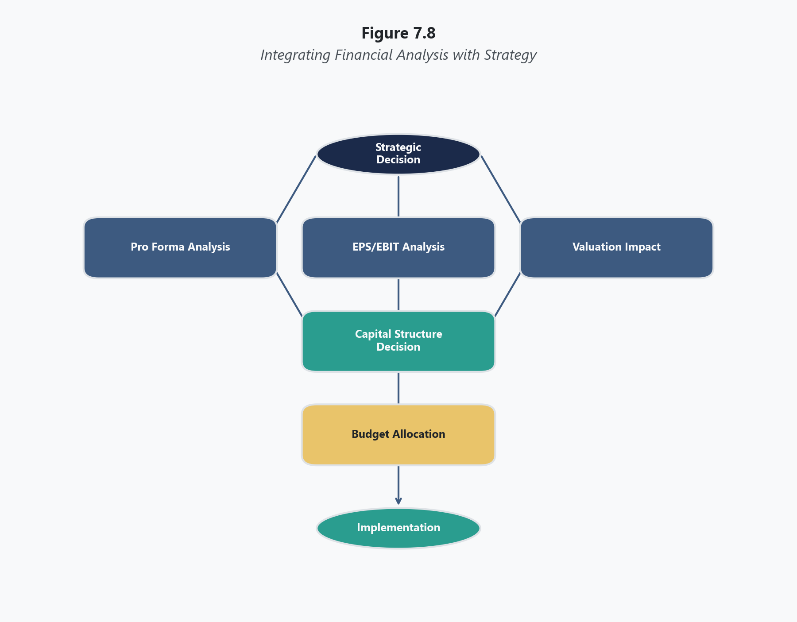

<!-- CWV: 5 -->

# Topic 7: Finance and Accounting in Strategy Implementation

## Opening

Early in my executive career, I watched a promising growth strategy collapse not because the market analysis was wrong, not because the product was flawed, and not because the competitive positioning was off. The strategy collapsed because no one had built the financial projections. The company committed to a major market expansion, announced it to employees and customers, began hiring regional sales teams, and then discovered — three months into execution — that the capital required to fund the expansion exceeded what the organization could raise without dangerously overleveraging its balance sheet. The expansion was quietly scaled back, the newly hired sales teams were let go, and the credibility of the leadership team was permanently damaged.

The lesson was not subtle. Strategy that is not grounded in financial reality is not strategy. It is aspiration dressed up in PowerPoint slides.

This topic examines the financial and accounting dimensions of strategy implementation — the quantitative backbone that transforms strategic intent into funded, measurable, executable plans. Where earlier topics examined what strategies to pursue and how to organize for execution, this topic examines how to pay for it, how to project its financial impact, how to determine whether debt or equity financing is more advantageous, and how to evaluate the worth of businesses being acquired or divested. These are not optional appendices to the strategic plan. They are the financial architecture without which the strategic plan is an unfunded mandate.

For many MBA students — particularly those whose strengths lie in marketing, leadership, or organizational behavior — this is the topic where strategy becomes uncomfortably numerical. That discomfort is productive. A strategist who cannot read a pro forma income statement, construct an EPS/EBIT analysis, or evaluate a business valuation is a strategist who cannot implement. And a strategy that cannot be implemented is not a strategy at all.

---

## Learning Objectives

By the end of this topic, you will be able to:

1. Prepare projected (pro forma) financial statements reflecting a recommended strategy's impact
2. Explain the purpose and process of financial budgeting in strategy implementation
3. Perform an EPS/EBIT analysis to determine whether debt or equity financing is more advantageous
4. Describe and apply methods for evaluating business worth: net worth, market capitalization, price-to-earnings ratio, and discounted cash flow
5. Explain how capital acquisition decisions (debt versus equity versus hybrid) affect implementation
6. Discuss how projected financial statements evaluate the feasibility and attractiveness of strategies
7. Describe the role of dividends and stock buybacks in corporate finance strategy
8. Integrate financial analysis with strategic recommendations in case analysis

---

## Projected Financial Statements

**Pro forma financial statements** are projected income statements and balance sheets that forecast the financial impact of a recommended strategy. They represent the most quantitative component of strategy implementation and serve as the bridge between qualitative strategic recommendations ("we should expand into the Southeast market") and quantitative financial reality ("here is what that expansion will cost, what revenue it will generate, and what it will do to our balance sheet over the next three years").

**Figure 7.4.** *Pro Forma Financial Statement Process*

### Pro Forma Income Statements

A projected income statement begins with the current year's actual income statement and applies assumptions about how the recommended strategy will change revenues and expenses. The process requires the strategist to translate every element of the strategy into financial terms.

Revenue projections must reflect specific strategic actions. If the strategy calls for market development, the projected revenue increase must be grounded in realistic assumptions about the new market's size, the company's expected market share, the timeline for customer acquisition, and the pricing strategy for the new market. If the strategy calls for product development, revenue projections must account for development timelines, launch costs, adoption rates, and cannibalization of existing products. Projections that simply assume a percentage increase in revenue without connecting that increase to specific strategic actions are analytically worthless.

Expense projections must capture both the direct costs of implementing the strategy and the indirect effects on existing operations. A market development strategy requires projecting additional sales force compensation, marketing spending, distribution costs, and administrative overhead for the new region. A product development strategy requires projecting R&D costs, manufacturing setup costs, inventory investment, and marketing launch expenses. A cost leadership strategy may project decreased cost of goods sold but increased capital expenditure for automation.

The discipline of building pro forma income statements forces strategic specificity. Vague strategies produce vague projections. Specific strategies produce specific projections that can be evaluated, challenged, and refined. When a leadership team cannot build a credible pro forma for their recommended strategy, it usually means the strategy itself has not been thought through with sufficient rigor.

### Pro Forma Balance Sheets

A projected balance sheet shows how the strategy will affect the organization's assets, liabilities, and equity over the projection period. The balance sheet projection must connect logically to the income statement projection — the two statements are not independent.

Asset projections reflect the investments required by the strategy. A growth strategy typically requires increases in accounts receivable (more customers buying on credit), inventory (more product to support higher sales), property and equipment (expanded facilities or new locations), and potentially intangible assets (acquired brands, patents, or goodwill from acquisitions). A retrenchment strategy may project decreases in assets as facilities are sold, inventory is reduced, and the organization shrinks its asset base.

Liability projections reflect how the strategy will be financed. If the strategy requires more assets than can be funded from operating cash flow and retained earnings, the organization must either borrow (increasing liabilities) or issue stock (increasing equity). The balance sheet projection reveals whether the strategy's asset requirements are feasible given the organization's borrowing capacity and willingness to dilute ownership through new equity issuance.

Equity projections reflect the cumulative effect of profitability and financing decisions. **Retained earnings** — the accumulated profits reinvested in the business rather than distributed as dividends — are the primary internal source of equity growth. If the projected income statement shows strong profitability and the dividend policy is conservative, retained earnings will grow and reduce the need for external financing. If profitability is thin or the dividend policy is generous, retained earnings growth will be insufficient and external capital will be required.

### Using Projections to Evaluate Strategy

Pro forma statements serve three critical functions in strategy evaluation.

First, they test **feasibility**. A strategy whose projected financial requirements exceed the organization's realistic capacity to raise capital is infeasible regardless of its strategic attractiveness. Projections reveal this infeasibility before resources are committed, when the cost of discovering the problem is merely analytical time rather than wasted capital.

Second, they test **attractiveness**. Even if a strategy is feasible, the projected returns may be insufficient to justify the investment. A strategy that requires $50 million in new investment but projects only $3 million in incremental annual profit produces a return that most organizations would find unattractive. Projections allow comparison of the strategy's projected returns against the organization's cost of capital, alternative investment opportunities, and minimum return requirements.

Third, they provide **accountability benchmarks**. Once a strategy is approved and implemented, the pro forma projections become the standard against which actual results are measured during the strategy evaluation process examined in Topic 6. Projected versus actual comparisons at quarterly and annual intervals reveal whether the strategy is performing as expected, underperforming, or exceeding projections, enabling timely corrective action.

---

## Financial Budgeting

**Financial budgets** are detailed plans for obtaining and spending funds to implement the chosen strategy. While pro forma statements provide a high-level financial picture, budgets translate that picture into specific, actionable funding plans at the departmental and project level.

**Figure 7.2.** *Financial Budget Hierarchy*

### Types of Budgets

Several budget types work together to fund strategy implementation.

A **capital budget** allocates funds to long-term assets and major projects. Capital budgets address questions such as: Which facilities will be built or expanded? What equipment will be purchased? What technology investments will be made? Capital budgets typically cover multi-year periods because the assets they fund have useful lives extending well beyond a single fiscal year. Capital budget decisions are among the most consequential in strategy implementation because they commit the organization to fixed assets that cannot be easily reversed.

An **operating budget** plans for day-to-day revenues and expenses. Operating budgets address the ongoing costs of running the business — payroll, materials, utilities, marketing, travel, and administrative expenses. Operating budgets typically cover one fiscal year and are updated annually to reflect changes in strategy, volume, and cost structure.

A **cash budget** projects cash inflows and outflows over a specific period, typically monthly or quarterly. Cash budgets are critical because profitability and cash flow are not the same thing. An organization can be profitable on an accrual basis while running out of cash if customers pay slowly, inventory must be purchased in advance, or capital investments require cash outlays before revenue is generated. Cash budget shortfalls must be addressed through short-term borrowing, accelerated collections, or deferred expenditures.

A **sales budget** projects expected revenue by product, region, or customer segment. The sales budget drives most other operating budgets because sales volume determines production requirements, inventory needs, marketing spending, and staffing levels. An unrealistic sales budget cascades errors through every subsequent budget.

A **profit budget** combines revenue and expense projections to forecast profitability by division, product line, or business unit. Profit budgets allow management to identify which parts of the organization are expected to generate returns and which are expected to consume resources.

The **master budget** integrates all subsidiary budgets into a comprehensive financial plan for the organization. The master budget ensures that individual departmental budgets are consistent with each other and with the overall strategic plan. Without master budget integration, departmental budgets may reflect conflicting assumptions about volume, pricing, resource availability, or strategic priorities.

### Budgets and Strategic Alignment

Budgets are the mechanism through which strategy becomes resource allocation. The strategic plan may declare that market development in Asia is the top priority, but the budget determines whether that priority receives $20 million or $2 million. When budgets do not align with strategic priorities, the organization is implementing a different strategy than the one it formulated — regardless of what the strategic plan document says.

Budget misalignment is among the most common implementation failures. Organizations frequently approve ambitious strategies and then allocate resources through budgeting processes that are driven by historical patterns, political negotiation, or incremental adjustment rather than strategic priority. The result is that the official strategy says one thing while the actual resource allocation says another. The resources always tell the truth. Whatever receives the most funding is the real strategy, regardless of what is written in the strategic plan.

---

## EPS/EBIT Analysis

**EPS/EBIT analysis** is a technique for determining whether debt financing or equity financing is more advantageous for the organization given its expected level of operating profitability. This analysis is critical when an organization must raise capital to fund a recommended strategy and must choose between borrowing money (debt) and selling ownership shares (equity).

**Figure 7.1.** *EPS/EBIT Analysis Chart*

### The Logic of the Analysis

**Earnings Per Share (EPS)** is calculated by dividing net income by the number of shares outstanding. EPS is one of the most closely watched metrics in corporate finance because it directly affects stock price and shareholder value.

**Earnings Before Interest and Taxes (EBIT)** represents the organization's operating profitability before the effects of financing decisions (interest expense) and tax obligations. EBIT measures how much the business earns from its operations regardless of how those operations are financed.

The relationship between EPS and EBIT differs depending on whether the organization uses debt or equity financing.

With **debt financing**, the organization borrows money and pays interest on the loan. The number of shares outstanding does not change, so net income (after deducting interest expense) is divided by the same number of shares. At high EBIT levels, debt financing produces higher EPS because the interest cost is fixed while earnings grow — the remaining earnings are spread across the same number of shares. At low EBIT levels, debt financing produces lower EPS because the fixed interest payments consume a larger proportion of limited earnings.

With **equity financing**, the organization issues new shares and uses the proceeds to fund the strategy. There is no interest expense, so all operating earnings flow to net income. However, those earnings are now divided among a larger number of shares. At low EBIT levels, equity financing produces higher EPS because there is no interest burden. At high EBIT levels, equity financing produces lower EPS because the earnings are diluted across more shares.

### The Crossover Point

The **crossover point** (also called the indifference point) is the EBIT level at which debt financing and equity financing produce identical EPS. Below this point, equity financing is preferable. Above this point, debt financing is preferable.

The crossover point is found by setting the EPS equations for debt and equity equal to each other and solving for EBIT. In graphical form, the debt financing line and equity financing line intersect at the crossover point. The debt line has a steeper slope (because earnings changes are distributed across fewer shares) and a lower y-intercept (because interest expense reduces EPS at low EBIT levels).

### Strategic Implications

EPS/EBIT analysis informs the financing decision but does not make it. Several additional factors must be considered.

**Risk tolerance** matters because debt financing amplifies both upside and downside outcomes. If EBIT exceeds expectations, debt financing produces superior EPS. If EBIT falls below expectations, debt financing produces worse EPS than equity would have — and unlike equity, debt carries a legal obligation to make interest and principal payments regardless of profitability. Organizations with volatile earnings should be cautious about debt financing because the downside risk is asymmetric.

**Control considerations** matter because equity financing dilutes existing shareholders' ownership percentage and voting power. For closely held companies or companies where management holds a significant ownership stake, the dilution associated with equity financing may be unacceptable even if the EPS analysis favors equity.

**Current leverage** matters because organizations that are already heavily leveraged face higher borrowing costs and greater financial risk from additional debt. An organization whose debt-to-equity ratio already exceeds industry norms should be cautious about adding more debt even if EPS/EBIT analysis favors it, because the cumulative leverage may jeopardize the organization's financial stability and credit rating.

**Market conditions** matter because the cost and availability of both debt and equity fluctuate with interest rates, credit market conditions, and stock market sentiment. A strategy that is optimally funded through equity in a bull market may need to be funded through debt in a bear market when stock prices are depressed and equity issuance would require excessive dilution.

---

## Evaluating Business Worth

Strategy implementation frequently requires evaluating the worth of businesses — the organization's own business, a competitor being considered for acquisition, or a division being considered for divestiture. Four primary methods are used, each with different assumptions, strengths, and limitations.

**Figure 7.3.** *Four Business Valuation Methods*

### Net Worth Method

The **net worth method** (also called the book value method) values a business based on its stockholders' equity as reported on the balance sheet: total assets minus total liabilities. This method is simple and objective because it relies on audited financial data.

However, the net worth method has significant limitations. Book values reflect historical cost minus depreciation, which may differ substantially from market values. A building purchased twenty years ago for $5 million and depreciated to $1 million on the balance sheet may have a market value of $15 million. Intangible assets — brand value, customer relationships, proprietary technology, organizational knowledge — often constitute the most valuable components of a business and are either absent from the balance sheet or carried at arbitrary values. The net worth method systematically undervalues most businesses because it ignores the present value of future earning potential.

### Market Capitalization

**Market capitalization** is calculated by multiplying the current stock price by the total number of shares outstanding. For publicly traded companies, market capitalization represents the market's collective assessment of the company's value at any given moment.

Market capitalization has the advantage of reflecting all available information about the company's prospects, competitive position, and earning potential as processed by millions of market participants. However, it also reflects market sentiment, which can be irrational. During periods of market euphoria, market capitalization may overstate fundamental value. During market panics, it may understate it. Market capitalization is also unavailable for privately held companies, limiting its applicability.

### Price-to-Earnings Method

The **price-to-earnings (P/E) method** estimates business value by multiplying the company's earnings per share by an appropriate price-to-earnings ratio. The P/E ratio can be drawn from the company's own historical P/E, the industry average P/E, or the P/E of comparable companies.

The P/E method's strength is that it incorporates both current earnings performance and market expectations about future growth (reflected in the P/E multiple). A high P/E ratio indicates that the market expects strong future earnings growth. A low P/E ratio indicates limited growth expectations. The P/E method is widely used in acquisition analysis because it provides a straightforward way to estimate what a company is worth based on its earnings power and comparable market valuations.

The P/E method's limitation is its sensitivity to the P/E multiple selected. Small changes in the multiple produce large changes in the estimated value. An organization earning $5 per share valued at 12x P/E is worth $60 per share. The same organization valued at 18x P/E is worth $90 per share. The choice of multiple requires judgment about growth prospects, risk, and market conditions that cannot be reduced to a formula.

### Discounted Cash Flow Method

The **discounted cash flow (DCF) method** values a business based on the present value of its expected future cash flows, discounted at an appropriate rate that reflects the time value of money and the riskiness of those cash flows. DCF is considered the most theoretically sound valuation method because it directly measures what a business is worth: the cash it will generate for its owners over time.

The DCF calculation requires projecting free cash flows for a defined forecast period (typically five to ten years), estimating a terminal value representing the business's value beyond the forecast period, and discounting all cash flows back to the present using a discount rate that reflects the cost of capital.

DCF's strength is its theoretical rigor and its focus on the fundamental driver of business value: cash generation. Its limitation is its sensitivity to assumptions. The projected cash flows, the growth rate, the discount rate, and the terminal value assumption each involve significant judgment, and small changes in any of these inputs produce large changes in the valuation output. A DCF that projects $10 million in annual free cash flow growing at 3% discounted at 10% produces a very different valuation than one projecting $10 million growing at 5% discounted at 8%. Both sets of assumptions may be defensible, but the valuations they produce will differ by hundreds of millions of dollars for a large organization.

### Using Multiple Methods

Prudent valuation uses multiple methods and compares the results. When net worth, market capitalization, the P/E method, and DCF produce similar valuations, confidence in the estimate is high. When the methods produce widely divergent valuations, the discrepancies deserve investigation. A company whose DCF valuation is three times its net worth likely has significant intangible assets or growth prospects that the balance sheet does not capture. A company whose market capitalization is well below its net worth may be undervalued by the market or may have assets carried at inflated book values.

In acquisition analysis, the valuation establishes the range within which negotiation occurs. The buyer prefers a price closer to net worth. The seller prefers a price closer to DCF or P/E valuation. The final price depends on negotiating power, the strategic importance of the acquisition, the availability of alternative targets, and the urgency of the transaction.

---

## Acquiring Capital

Strategy implementation requires capital, and the source of that capital — **debt**, **equity**, or **hybrid instruments** — carries strategic implications beyond the immediate financing need.

**Figure 7.5.** *Capital Structure Decision Framework*

### Debt Financing

Debt financing involves borrowing money through bank loans, corporate bonds, credit facilities, or other lending arrangements. The organization receives cash and commits to repaying the principal with interest over a specified period.

Debt financing offers several advantages. Interest payments are tax-deductible, reducing the effective cost of debt below the stated interest rate. Debt does not dilute ownership — existing shareholders retain their proportional ownership and control. And debt is typically cheaper than equity for financially healthy organizations because lenders accept a lower return in exchange for the greater certainty of contractual repayment.

The disadvantages of debt are significant. Interest and principal payments are legal obligations that must be met regardless of the organization's profitability. High leverage increases financial risk because fixed debt service payments amplify the impact of revenue fluctuations on net income. Debt covenants may restrict the organization's operational flexibility by imposing limits on additional borrowing, capital expenditures, dividends, or other management decisions. And excessive debt can jeopardize the organization's credit rating, increasing future borrowing costs and potentially triggering liquidity crises.

### Equity Financing

Equity financing involves selling ownership shares — either through public stock offerings, private placements, or retention of earnings. The organization receives cash without a repayment obligation.

Equity financing offers the advantage of flexibility. There are no mandatory payments — dividends are discretionary, not contractual. Equity strengthens the balance sheet by increasing the equity base and reducing leverage ratios. And equity financing does not impose the restrictive covenants that often accompany debt.

The disadvantages of equity are also significant. Equity is typically more expensive than debt because shareholders demand higher returns to compensate for their subordinate position in the capital structure (equity holders are paid after debt holders in bankruptcy). New share issuance dilutes existing shareholders' ownership percentage and voting power. And equity financing may signal to the market that management believes the stock is overvalued, potentially depressing the stock price.

### Hybrid Instruments

**Hybrid instruments** combine features of both debt and equity. Convertible bonds can be converted into equity at the holder's option, providing debt-like cash flow protection with equity-like upside participation. Preferred stock pays fixed dividends (like debt interest) but represents ownership rather than a loan, and preferred dividends can typically be suspended without triggering default. Hybrid instruments allow organizations to customize their financing structures to balance cost, risk, control, and flexibility considerations.

### Capital Structure Decisions

The mix of debt and equity — the organization's **capital structure** — is itself a strategic decision. A highly leveraged capital structure amplifies returns for equity holders when times are good but increases financial distress risk when times are bad. A conservatively capitalized structure provides financial stability and flexibility but may produce lower returns for equity holders because the organization is not taking full advantage of cheaper debt financing.

The optimal capital structure depends on the organization's industry (capital-intensive industries typically carry more debt), earnings stability (organizations with stable earnings can support more debt than those with volatile earnings), growth rate (high-growth organizations may prefer equity to preserve borrowing capacity for future needs), and strategic flexibility requirements (organizations pursuing acquisition strategies need borrowing capacity to fund deals quickly).

---

## Dividends and Stock Buybacks

Two mechanisms distribute value to shareholders: **dividends** and **stock buybacks**. The choice between them carries strategic implications.

**Figure 7.7.** *Dividend and Stock Buyback Decision Factors*

### Dividend Policy

A **dividend** is a cash payment from the corporation to its shareholders, typically paid quarterly. **Dividend policy** — the organization's approach to determining how much of its earnings to distribute as dividends versus reinvesting in the business — reflects a fundamental strategic trade-off.

High dividends provide immediate income to shareholders but reduce the cash available for reinvestment in growth opportunities. This policy is appropriate for mature organizations in slow-growth industries where internal investment opportunities offer returns below what shareholders could earn by investing dividends elsewhere.

Low or no dividends retain cash within the organization for reinvestment. This policy is appropriate for high-growth organizations where internal investment opportunities offer returns above what shareholders could earn on their own. Shareholders of growth companies expect returns through stock price appreciation rather than dividend income.

Stable dividend policies — maintaining or gradually increasing dividends over time — signal management confidence in the organization's earnings stability and reduce uncertainty for income-oriented investors. Dividend cuts signal financial distress and typically cause sharp stock price declines, making management reluctant to establish dividend levels that cannot be sustained.

### Stock Buybacks

A **stock buyback** (share repurchase) occurs when the organization purchases its own shares on the open market. Buybacks reduce the number of shares outstanding, which increases EPS and, all else being equal, the stock price.

Buybacks have become an increasingly popular mechanism for returning value to shareholders because they offer greater flexibility than dividends. A dividend, once established, creates expectations that it will be maintained. A buyback program can be accelerated, decelerated, or suspended without the negative signaling associated with dividend changes. Buybacks also provide tax advantages for shareholders in many jurisdictions because capital gains (from the resulting stock price increase) may be taxed at lower rates than dividend income.

The strategic criticism of stock buybacks is that they may reflect a lack of attractive internal investment opportunities. An organization that buys back billions of dollars in stock is implicitly saying that it cannot find investments in its own business that would produce adequate returns. When buybacks are funded by debt rather than excess cash, the criticism intensifies: the organization is leveraging its balance sheet not to invest in growth but to financially engineer its EPS.

---

## Financial Ratios in Implementation Monitoring

Financial ratios, introduced in Topic 3 as part of internal assessment, serve a different function during implementation: they become the quantitative monitoring system for tracking whether the strategy is producing expected financial results.

**Figure 7.6.** *Financial Ratio Monitoring in Implementation*

The ratios most relevant to implementation monitoring include:

**Liquidity ratios** (current ratio, quick ratio) monitor whether the organization can meet short-term obligations during the implementation period, which may involve significant cash outflows before revenue increases materialize.

**Leverage ratios** (debt-to-equity, debt-to-total-assets) monitor whether the organization's borrowing levels remain within acceptable ranges as implementation progresses, particularly if the strategy is funded through debt.

**Profitability ratios** (ROI, ROE, net profit margin) monitor whether the strategy is generating expected returns. Declining profitability ratios during early implementation may be expected (investment periods precede returns), but persistent profitability decline signals that the strategy may not be producing the projected results.

**Activity ratios** (asset turnover, inventory turnover) monitor whether the organization is using its expanded asset base efficiently.

**Growth ratios** (revenue growth, EPS growth) monitor the strategy's top-line impact. Revenue growth that falls below projections may indicate market assumptions were too optimistic, competitive response was underestimated, or implementation execution is lagging.

The critical discipline is comparing actual ratios against the pro forma projections established during planning. Variances should be analyzed for causes and addressed through the corrective action process described in Topic 6. Small variances may represent timing differences or estimation imprecision. Large or persistent variances signal that either the strategy's assumptions were flawed or the implementation is failing to execute as planned.

---

## Integrating Financial Analysis with Strategic Recommendations

In case analysis and in practice, financial analysis is not a separate exercise performed after the strategic analysis is complete. It is an integral component of the strategic recommendation. A strategic recommendation that does not include financial projections, financing plans, and valuation analysis is incomplete.

**Figure 7.8.** *Integrating Financial Analysis with Strategy*

The integration follows a logical sequence. Strategic analysis (SWOT, SPACE, BCG, IE, QSPM) identifies the recommended strategy. Pro forma financial statements project the strategy's financial impact. EPS/EBIT analysis determines the optimal financing approach. Valuation analysis evaluates acquisition targets or divestiture candidates. Budget analysis allocates resources to specific implementation activities. And ratio monitoring provides the ongoing measurement system.

Each financial analysis either supports or challenges the strategic recommendation. If pro forma projections show that the recommended strategy will produce strong returns and can be financed without excessive leverage, the financial analysis supports the recommendation. If projections show that the strategy requires capital the organization cannot raise, or that projected returns are inadequate, the financial analysis challenges the recommendation and may require returning to the formulation stage to consider alternative strategies.

This integration is what separates MBA-level strategic analysis from the superficial recommendations that characterize much corporate strategy work. Anyone can recommend "growth." The strategist who can project exactly what that growth will cost, how it will be financed, what returns it will produce, and how those returns compare to alternative uses of capital is the strategist who creates genuine organizational value.

---

## Application: Disney's Acquisition of 21st Century Fox

The Walt Disney Company's $71 billion acquisition of 21st Century Fox's entertainment assets in 2019 illustrates how financial analysis integrates with strategic decision-making at the highest level.

The strategic logic was clear: Disney was launching its Disney+ streaming platform to compete with Netflix and needed a massive content library. Fox's assets included the 20th Century Fox film studio, FX Networks, National Geographic, and a controlling stake in Hulu — all of which would dramatically expand Disney's content portfolio and streaming capabilities.

The valuation challenge was enormous. Disney used multiple valuation methods to determine what Fox's entertainment assets were worth. The net worth method would have dramatically undervalued the assets because the most valuable components — film libraries, brand franchises, subscriber relationships — are largely intangible. Market capitalization provided a reference point but reflected the entire Fox conglomerate rather than the specific assets Disney was acquiring. DCF analysis became the primary valuation method, projecting future cash flows from the content library, subscriber growth for streaming platforms, and synergy savings from combining operations.

The EPS/EBIT analysis was consequential. Disney ultimately financed the acquisition through a combination of cash and stock (issuing new Disney shares to Fox shareholders), diluting existing shareholders' ownership by approximately 25%. The decision to use significant equity rather than all-debt financing reflected the massive size of the transaction relative to Disney's existing balance sheet. Funding $71 billion entirely through debt would have overleveraged the company dangerously. The equity component maintained financial flexibility for the enormous content investment required to build Disney+.

The pro forma projections were critical to board approval. Disney's management projected that the acquisition would be accretive to EPS within two years (meaning it would increase rather than decrease EPS despite the share dilution) and would produce significant cost synergies through the elimination of redundant operations. These projections became the benchmarks against which the acquisition's success was measured.

The budget implications were staggering. Beyond the $71 billion purchase price, Disney committed billions in additional capital expenditure for Disney+ content development, technology infrastructure, and global marketing. The capital budget for the three years following the acquisition was the largest in the company's history, reflecting the strategic reality that buying Fox was only the beginning — building a competitive streaming platform required sustained investment beyond the acquisition.

---

## Application: WeWork's Valuation Collapse

If Disney illustrates disciplined financial analysis supporting a strategic acquisition, WeWork illustrates the consequences of financial analysis that is disconnected from reality.

WeWork's initial public offering filing in 2019 revealed a company valued by private investors at $47 billion that had never generated a profit, was burning cash at an accelerating rate, and had a business model whose unit economics were fundamentally questionable. The company leased office space on long-term contracts and subleased it on short-term contracts — a model that guaranteed losses during economic downturns when subtenants would vacate while WeWork's lease obligations remained.

The valuation methods used to justify the $47 billion figure relied almost entirely on projected future growth rather than current financial performance. The DCF analysis assumed revenue growth rates that required exponential expansion into increasingly competitive markets. The comparable company analysis compared WeWork to technology companies rather than real estate companies, producing dramatically higher valuation multiples. The net worth analysis was not even mentioned because the company's tangible assets were negligible relative to the valuation.

When the IPO filing made the company's financial details public, the market applied more rigorous financial analysis. Pro forma projections revealed that the company's path to profitability required assumptions about market growth, pricing power, and cost reduction that few independent analysts found credible. The valuation collapsed from $47 billion to approximately $8 billion, and the IPO was withdrawn.

WeWork's experience validates a principle that should guide every financial analysis in strategic management: projections must be grounded in defensible assumptions, and valuations must be supported by multiple methods that produce converging results. When a company can only be valued at its claimed worth by using aggressive assumptions in a single valuation method while ignoring methods that produce dramatically lower values, the valuation is not analysis. It is advocacy.

---

## Ethical Considerations and Financial Stewardship

The financial tools in this topic carry substantial ethical weight because they determine how organizational resources are allocated, how business value is assessed, and how the interests of different stakeholders are balanced.

The Parable of the Talents in Matthew 25:14-30 provides the foundational principle. The master entrusts servants with resources ("talents") and expects a return. The servants who invest wisely and generate returns are commended. The servant who buries his talent out of fear is condemned — not for losing money, but for failing to deploy the resources entrusted to him. The parable is about stewardship: the obligation to use what you have been given productively and faithfully.

Applied to corporate finance, this parable reframes every financial decision in this topic. Pro forma projections are not merely forecasting exercises; they are stewardship plans that articulate how the organization intends to deploy entrusted resources. EPS/EBIT analysis is not merely a technical calculation; it is a stewardship decision about how to fund the deployment of those resources in the way that best serves the organization's mission. Valuation is not merely a pricing exercise; it is an assessment of how faithfully a business's resources have been deployed and what they are worth as a result.

Deuteronomy 8:17-18 adds a complementary dimension: "You may say to yourself, 'My power and the strength of my hands have produced this wealth for me.' But remember the Lord your God, for it is he who gives you the ability to produce wealth." This passage guards against the arrogance that financial success can produce. Organizations that generate strong returns, achieve high valuations, and access capital easily may begin to attribute their success entirely to management brilliance. The passage reminds the strategist that the ability to produce wealth — the market conditions, the technological infrastructure, the educated workforce, the legal systems that enable commerce — is not of the organization's own making. Financial stewardship begins with humility about the sources of financial success.

This stewardship perspective has practical implications. Pro forma projections should be honest, not optimistic. Organizations that inflate projections to justify a preferred strategy are not practicing good financial planning — they are deceiving their boards, their investors, and themselves. Valuation analysis should be rigorous, not advocacy. When the valuation of an acquisition target depends entirely on aggressive assumptions, the acquirer is not conducting due diligence — they are rationalizing a decision already made. And capital structure decisions should balance risk and return rather than maximizing short-term EPS through aggressive leverage. Overleveraging to boost EPS may reward current shareholders at the expense of long-term organizational stability, which is not stewardship but extraction.

---

## Conclusion

Financial analysis is not an appendix to strategic management. It is the discipline that determines whether strategies can be funded, whether their projected returns justify their costs, and whether the organization's financial resources are being deployed as wise stewards rather than wishful thinkers.

Pro forma financial statements translate strategic intent into quantitative projections that can be evaluated for feasibility and attractiveness. Financial budgets allocate resources at the operational level where implementation actually occurs. EPS/EBIT analysis guides the financing decision between debt and equity. Valuation methods establish the worth of businesses being acquired, divested, or managed. And financial ratio monitoring provides the ongoing measurement system that connects strategy implementation back to strategy evaluation.

The strategist who can connect a SWOT analysis to a pro forma income statement, determine the optimal capital structure for funding the recommended strategy, evaluate an acquisition target using multiple valuation methods, and monitor implementation through ratio analysis is the strategist who can bridge the gap between strategic aspiration and organizational results. Financial literacy is not optional for the strategic manager. It is the language in which strategy becomes real.

---

## Key Terms

**Capital Budget** — A plan allocating funds to long-term assets and major projects over a multi-year period

**Capital Structure** — The mix of debt and equity financing used by an organization, affecting risk, cost of capital, and financial flexibility

**Discounted Cash Flow (DCF)** — A valuation method that calculates business worth as the present value of expected future cash flows discounted at an appropriate rate

**Dividend Policy** — An organization's approach to determining how much of its earnings to distribute to shareholders as dividends versus reinvesting in the business

**Earnings Before Interest and Taxes (EBIT)** — A measure of operating profitability before the effects of financing decisions and tax obligations

**Earnings Per Share (EPS)** — Net income divided by the number of shares outstanding, representing the portion of profits allocated to each share

**EPS/EBIT Analysis** — A technique comparing earnings per share under debt versus equity financing at various levels of operating profitability to determine the more advantageous financing method

**Market Capitalization** — A valuation measure calculated by multiplying the current stock price by the total number of shares outstanding

**Master Budget** — A comprehensive financial plan integrating all subsidiary budgets into a unified organizational budget

**Net Worth Method** — A valuation approach based on stockholders' equity as reported on the balance sheet (total assets minus total liabilities)

**Operating Budget** — A plan for day-to-day revenues and expenses covering one fiscal year

**Price-to-Earnings (P/E) Ratio** — Stock price divided by earnings per share, reflecting market expectations about future earnings growth

**Pro Forma Financial Statements** — Projected income statements and balance sheets forecasting the financial impact of a recommended strategy

**Retained Earnings** — Accumulated profits reinvested in the business rather than distributed as dividends to shareholders

**Stock Buyback** — A company's repurchase of its own shares on the open market, reducing shares outstanding and increasing earnings per share

---

## Knowledge Check

### Multiple Choice

**Question 1 [Bloom's: Analyze]**

A company's pro forma income statement projects that a market development strategy will increase revenue by 25% and require $15 million in additional marketing and distribution expenses. However, the pro forma balance sheet reveals that funding the strategy requires increasing debt-to-equity from 0.8 to 2.3. What does this discrepancy suggest?

A) The strategy is financially sound because the revenue increase justifies the additional expense
B) The income statement projection is favorable but the balance sheet projection reveals that the strategy requires leveraging the company to a level that may create excessive financial risk, suggesting the need to explore equity financing, phased implementation, or a less capital-intensive approach
C) The debt-to-equity ratio is irrelevant if the strategy produces strong revenue growth
D) The company should abandon the market development strategy entirely because the financing is too expensive

*Correct Answer: B*
*Rationale: Pro forma analysis requires evaluating both the income statement and balance sheet together. The income statement shows the strategy is profitable, but the balance sheet reveals the strategy requires a nearly threefold increase in leverage (0.8 to 2.3), which may exceed the organization's risk tolerance, violate debt covenants, or damage its credit rating. The appropriate response is not to abandon the strategy (Answer D) but to explore alternative financing structures or implementation approaches that achieve the strategic objective without excessive leverage. Answer A ignores the balance sheet warning. Answer C dismisses a critical financial risk indicator.*

**Question 2 [Bloom's: Analyze]**

An EPS/EBIT analysis shows a crossover point at $8 million EBIT. The company's current EBIT is $12 million, and the strategy is projected to increase EBIT to $15 million. However, the industry is cyclical, and EBIT dropped to $5 million during the last economic downturn. Which financing recommendation is most appropriate?

A) Use debt financing because projected EBIT ($15M) significantly exceeds the crossover point ($8M)
B) Use equity financing because the cyclical risk means EBIT could fall below the crossover point during downturns, and debt service obligations would magnify losses during periods of reduced earnings
C) Split financing 50/50 between debt and equity as a compromise
D) Delay the strategy until EBIT has been above the crossover point for at least five consecutive years

*Correct Answer: B*
*Rationale: While current and projected EBIT favor debt financing (both exceed the $8M crossover), the industry's cyclical nature means EBIT could drop to $5M (below the crossover), where debt financing produces worse EPS than equity and where fixed interest payments could create financial distress. EPS/EBIT analysis must be interpreted in the context of earnings volatility, not just current or projected earnings. The downside risk of debt in a cyclical industry may outweigh the upside benefit during normal operations. Answer A ignores cyclical risk. Answer C lacks analytical justification. Answer D is overly conservative and ignores strategic urgency.*

**Question 3 [Bloom's: Analyze]**

A company is considering acquiring a competitor. The four valuation methods produce the following estimates: Net Worth = $200 million, Market Capitalization = $450 million, P/E Method = $520 million, DCF = $580 million. What does this valuation spread most likely indicate?

A) The company should use the average ($437.5M) as the fair value
B) The significant gap between net worth ($200M) and DCF ($580M) suggests the target has substantial intangible assets, growth prospects, or earning power not captured on the balance sheet, and the acquiring company should investigate what drives the premium above book value before setting an offer price
C) The net worth method is the most reliable because it is based on audited financial statements
D) The DCF value should be used because it is the most theoretically sound method

*Correct Answer: B*
*Rationale: A nearly 3x spread between net worth and DCF indicates that most of the target's value lies in assets not reflected on the balance sheet — brand equity, customer relationships, intellectual property, growth potential, or operational synergies. Before offering $450-580M for a company with $200M in tangible net worth, the acquirer must understand specifically what justifies the premium. This due diligence is essential because intangible value assumptions may be wrong, and overpaying for an acquisition based on inflated intangible value expectations is one of the most common causes of acquisition failure. Answer A mechanically averages without analysis. Answer C ignores the balance sheet's known limitations with intangible assets. Answer D selects one method without integrating all four.*

**Question 4 [Bloom's: Analyze]**

A company with strong growth opportunities (internal rate of return on investments averaging 18%) currently pays a dividend yielding 4% and spends $500 million annually on stock buybacks. An analyst argues that the company should eliminate dividends and buybacks and reinvest all cash in growth opportunities. Using the financial strategy framework, evaluate this argument.

A) The analyst is correct because internal investments earning 18% clearly outperform the 4% dividend
B) The argument has merit because reinvesting at 18% returns creates more shareholder value than dividends, but eliminating dividends entirely would signal financial distress and potentially cause a stock price decline, while buybacks provide flexibility and should be evaluated against specific investment opportunities on a case-by-case basis
C) Dividends should be maintained because shareholders expect them, regardless of available investment returns
D) The company should increase buybacks rather than eliminate them because buybacks increase EPS

*Correct Answer: B*
*Rationale: The financial logic favoring reinvestment is sound — an 18% internal return exceeds what most shareholders could earn independently. However, the recommendation to eliminate dividends ignores signaling effects: dividend cuts are interpreted by markets as financial distress signals, often causing significant stock price declines regardless of the strategic rationale. The optimal approach is more nuanced: maintain a sustainable base dividend (avoiding the negative signaling of a cut), evaluate buyback spending against specific investment opportunities (redirecting buyback capital to high-return projects when available), and communicate the investment thesis clearly to shareholders. Answer A ignores market signaling. Answer C ignores return optimization. Answer D focuses on EPS engineering rather than value creation.*

**Question 5 [Bloom's: Analyze]**

A company's strategy implementation monitoring reveals the following at the six-month checkpoint: revenue is 15% below pro forma projections, but expenses are 20% below projections (because hiring and expansion were delayed). As a result, net income is actually above projections. The CEO argues that the strategy is performing well because profitability exceeds expectations. What is wrong with this assessment?

A) Nothing is wrong; profitability is the most important metric
B) The CEO is confusing implementation delay with strategic success — expenses are below projection because the strategy has not been fully implemented, not because of superior cost management, and the revenue shortfall indicates the strategy may be underperforming or behind schedule
C) The CEO should focus on revenue rather than profitability during implementation
D) The monitoring system is flawed because it should only compare actual to projected revenue

*Correct Answer: B*
*Rationale: The CEO's assessment confuses delayed execution with superior performance. Expenses are below projection not because of efficiency but because the company has not yet spent the money the strategy requires (hiring and expansion were delayed). The revenue shortfall may indicate that the strategic assumptions about market demand were optimistic, that execution is behind schedule, or both. Current profitability above projections is an artifact of incomplete implementation, not evidence of strategic success. When the delayed investments are eventually made, expenses will catch up while revenue may remain below projections, producing worse-than-projected profitability. This is exactly the kind of misleading financial signal that pro forma comparison is designed to detect. Answers A, C, and D each accept an incomplete analytical framework.*

**Question 6 [Bloom's: Analyze]**

A private equity firm offers to purchase a struggling division of a large corporation through a leveraged buyout. The division has $50 million in assets, generates $8 million in annual EBIT, and the PE firm offers $120 million, planning to finance 80% through debt secured by the division's assets. From the corporation's perspective, what financial and strategic factors should inform the divestiture decision?

A) Accept the offer because $120 million exceeds the division's $50 million in net assets
B) Evaluate whether $120 million represents fair value using multiple valuation methods, consider the PE firm's likely plans for the division (aggressive cost-cutting, asset stripping, or genuine turnaround), assess the strategic impact of losing the division on the remaining portfolio, and recognize that the highly leveraged structure (80% debt) may indicate the PE firm plans to extract value through financial engineering rather than operational improvement
C) Reject the offer because LBOs always result in employee layoffs and the corporation has an ethical obligation to protect workers
D) Accept only if the PE firm agrees to maintain current employment levels for five years

*Correct Answer: B*
*Rationale: The divestiture decision requires multiple forms of analysis. First, valuation: does $120M represent fair value? At $8M EBIT, the offer represents a 15x EBIT multiple — is this reasonable for the industry? Second, strategic impact: does losing this division affect the corporation's remaining operations, customer relationships, or competitive position? Third, the buyer's intentions: an 80% debt-financed LBO suggests the PE firm may plan aggressive restructuring to service the debt, which could include layoffs, asset sales, or operational changes that affect the division's employees and communities. Answer A uses only the simplest valuation method. Answer C applies an absolute ethical rule without analysis. Answer D imposes a condition that may not be enforceable or commercially realistic.*

**Question 7 [Bloom's: Analyze]**

A company preparing pro forma statements for a product development strategy makes the following assumptions: the new product will capture 15% market share in year one, production costs will be 20% below industry average due to proprietary technology, and no competitors will introduce competing products for at least two years. An experienced strategist reviews these assumptions. What is the most appropriate critique?

A) The assumptions are acceptable because they are based on the company's competitive advantages
B) Each assumption should be stress-tested: 15% market share in year one is aggressive for a new product, the 20% cost advantage assumes competitors cannot replicate the technology, and the two-year competitive window ignores the speed of competitive response in most industries — the pro forma should include sensitivity analysis showing financial outcomes under less favorable assumptions
C) The assumptions are too conservative because the company's technology advantage should produce even higher market share
D) The assumptions are irrelevant because pro forma statements are only estimates and will be revised as actual data becomes available

*Correct Answer: B*
*Rationale: Pro forma projections are only as reliable as their underlying assumptions, and all three assumptions in this scenario are optimistic. First-year market share of 15% for a new product is aggressive unless the company has an established distribution network and brand (even then, 15% is ambitious). A 20% cost advantage assumes the proprietary technology provides durable cost benefits that competitors cannot match or substitute. A two-year competitor-free window ignores the reality that successful new products attract competitive responses rapidly. The strategist should require sensitivity analysis showing what happens if market share is 8% instead of 15%, if cost advantages erode to 10%, or if competitors respond within twelve months. Answer A accepts the assumptions uncritically. Answer C doubles down on optimism. Answer D dismisses the importance of assumption quality.*

**Question 8 [Bloom's: Analyze]**

A corporation's board is debating capital structure for funding a major acquisition. The CFO proposes 70% debt financing, arguing it maximizes EPS due to the tax deductibility of interest. The CEO proposes 40% debt and 60% equity, arguing for financial flexibility. The company currently has a debt-to-equity ratio of 1.2 (industry average is 0.9). Which analysis framework should guide this decision?

A) The CFO is correct because maximizing EPS should always be the primary financial objective
B) The decision should integrate EPS/EBIT analysis (determining which financing mix maximizes EPS at projected EBIT levels), risk analysis (considering the company's already above-average leverage), strategic flexibility analysis (whether future opportunities require borrowing capacity), and market conditions (current cost and availability of both debt and equity)
C) The CEO is correct because equity financing is always safer than debt
D) The company should use whatever financing method its competitors typically use

*Correct Answer: B*
*Rationale: Capital structure decisions require integrating multiple analytical frameworks, not optimizing for a single metric. EPS/EBIT analysis is relevant but not sufficient: the company already carries above-average leverage (1.2 vs. 0.9 industry average), so adding 70% debt financing would further increase leverage and financial risk. The CEO's concern about flexibility is legitimate — if the company uses most of its borrowing capacity for this acquisition, it may be unable to fund future opportunities or survive economic downturns. Market conditions (current interest rates and equity market sentiment) also affect the relative attractiveness of debt versus equity. Answer A optimizes for one metric while ignoring risk. Answer C applies an absolute rule without analysis. Answer D substitutes benchmarking for analysis.*

**Question 9 [Bloom's: Analyze]**

A technology startup is seeking Series C funding and presents investors with a DCF valuation of $2 billion. The DCF assumes 60% annual revenue growth for five years, 40% EBITDA margins at maturity, and a discount rate of 12%. The company's current revenue is $30 million with negative EBITDA. What is the most significant concern with this valuation?

A) The discount rate is too low for a startup, which should be 20-30% to reflect higher risk
B) Multiple concerns exist: the 60% growth rate sustained for five years is extremely aggressive, 40% EBITDA margins assume a profitability level achieved by very few companies, the low discount rate understates the risk of a pre-profit company, and using DCF for a company with no current positive cash flow means the entire valuation rests on speculative future projections — the valuation should be cross-checked against revenue multiples of comparable companies
C) DCF is an inappropriate method for startups and should not be used
D) The valuation is reasonable if the company operates in a high-growth industry

*Correct Answer: B*
*Rationale: The valuation is problematic across multiple dimensions. Growth of 60% annually for five years would bring revenue from $30M to approximately $237M — aggressive but not impossible for a successful startup. However, combining aggressive growth with 40% mature EBITDA margins and a 12% discount rate compounds optimistic assumptions. Each assumption alone might be defensible; together they create a valuation that only materializes under best-case conditions. The most fundamental concern is using DCF for a company with no positive cash flow — the entire $2B valuation is built on projections of future profitability that does not yet exist. Cross-checking against comparable company revenue multiples (e.g., 10-20x current revenue = $300-600M) would reveal how far the DCF estimate departs from market-based valuations. Answer A identifies only one concern. Answer C overstates — DCF can be used for startups but with higher discount rates. Answer D accepts aggressive assumptions uncritically.*

**Question 10 [Bloom's: Analyze]**

A company has generated $200 million in free cash flow. The CEO must decide between three uses: (1) fund an acquisition valued at $180 million that would provide entry into an adjacent market, (2) execute a $200 million stock buyback to boost EPS before the annual earnings report, or (3) pay a special dividend of $4.00 per share. Which analytical framework should guide this decision?

A) Execute the buyback because it directly increases EPS, which drives stock price
B) The decision should compare the expected return on the acquisition investment against the company's cost of capital, evaluate whether the adjacent market opportunity is strategically compelling (using the strategy formulation tools from Topic 4), assess whether the stock is undervalued (making buybacks attractive) or overvalued (making buybacks wasteful), and consider shareholder preferences — the timing of the buyback specifically to precede the earnings report raises concerns about EPS manipulation rather than genuine value creation
C) Pay the special dividend because it directly returns value to all shareholders equally
D) Fund the acquisition because growth through acquisition is always preferable to returning cash to shareholders

*Correct Answer: B*
*Rationale: Capital allocation decisions must be evaluated based on which use creates the most long-term value. The acquisition should be evaluated for strategic fit and projected returns using pro forma analysis and valuation methods. Buybacks are appropriate when the stock is undervalued, but timing a buyback specifically to boost EPS before an earnings report raises ethical concerns about financial manipulation — the company is using cash to manufacture an EPS increase rather than create genuine value. A special dividend returns cash directly but sacrifices investment opportunities. The correct framework considers return on investment, strategic value, stock valuation, shareholder interests, and the ethical dimension of timing. Answer A prioritizes EPS manipulation. Answer C and D each advocate one option without comparative analysis.*

### Critical Thinking

**Scenario 1**

You are the CFO of a mid-sized manufacturing company. The strategic plan calls for building a new production facility to support a product development strategy. The facility will cost $75 million. Your current financial position includes $20 million in cash, a debt-to-equity ratio of 0.7 (industry average: 1.0), and annual EBIT of $35 million. The EPS/EBIT crossover point for the additional $55 million needed is at $22 million EBIT. Your company's EBIT has ranged from $28 million to $42 million over the past five years.

The board has asked you to recommend a financing structure. You must present pro forma income statements and balance sheets under three scenarios: (1) 100% debt financing, (2) 100% equity financing, and (3) a 60/40 debt/equity split. Additionally, two board members have expressed concern about taking on any additional debt, while three others have argued that equity dilution is unacceptable.

**Question:** Develop your financing recommendation, explaining which structure you would choose and why. Address the EPS/EBIT analysis, the risk implications of each scenario, the strategic flexibility considerations, and how you would respond to the board members' conflicting concerns. How do the pro forma projections under each scenario support your recommendation?

**Rubric:**

| Score | Criteria |
|-------|----------|
| Excellent (9-10) | Analyzes all three financing scenarios with specific reference to EPS/EBIT dynamics (all historical EBIT levels exceed the $22M crossover, favoring debt on an EPS basis). Balances the EPS advantage of debt against risk considerations (lowest EBIT of $28M provides only $6M cushion above crossover). Recognizes the company's below-average leverage provides debt capacity. Considers strategic flexibility — whether future investments may require borrowing capacity. Addresses both board factions with data rather than opinion. Recommends a specific structure with clear justification and acknowledges trade-offs. Connects the recommendation to pro forma outcomes. |
| Proficient (7-8) | Analyzes the financing scenarios using EPS/EBIT analysis and risk considerations. Makes a defensible recommendation with supporting logic. Addresses board concerns. May lack depth in one area (flexibility, pro forma specifics, or risk analysis). |
| Developing (5-6) | Recommends a financing structure but with limited analytical support. May address EPS/EBIT analysis or risk but not both. Limited engagement with the board's conflicting concerns. |
| Needs Work (3-4) | Recommends a structure without analytical framework or ignores key financial considerations. Does not address the trade-offs between scenarios. |

**Scenario 2**

A publicly traded retail company (current stock price: $45, P/E ratio: 14, annual EPS: $3.21, shares outstanding: 50 million) is being approached by a private equity firm offering to acquire the company through an LBO at $62 per share. The PE firm plans to finance 75% of the acquisition through debt. The company's net worth (book value) is $800 million. The industry average P/E is 18. A DCF analysis using conservative assumptions values the company at $68 per share; using aggressive assumptions, $82 per share.

The board must decide whether to accept, reject, or negotiate the $62 offer. Employees are anxious because LBOs typically result in cost-cutting. The company's largest institutional shareholders (holding 35% of shares collectively) have indicated they would support the deal at $62. The CEO personally opposes the acquisition.

**Question:** Using the four valuation methods, evaluate whether $62 per share represents fair value. What additional information would you need to make this assessment complete? How should the board weigh shareholder value (the premium over current stock price), employee welfare (likely cost-cutting under PE ownership), and long-term strategic independence (the CEO's concern)? Is there a financially and ethically sound path forward?

**Rubric:**

| Score | Criteria |
|-------|----------|
| Excellent (9-10) | Applies all four valuation methods systematically: net worth = $800M / 50M shares = $16/share (floor, significantly below offer), market cap = $45 x 50M = $2.25B vs. offer of $3.1B (38% premium), P/E method using industry average = 18 x $3.21 = $57.78 (below offer), DCF = $68-82/share (offer is below conservative DCF). Concludes that $62 is above current market value and P/E-based value but below DCF value, suggesting room for negotiation. Identifies additional information needed (PE firm's operational plans, comparable LBO outcomes, contractual protections for employees). Engages the shareholder-employee-independence tension substantively. Considers negotiation strategies (higher price, employee protections, earnout provisions). Shows awareness that the CEO's opposition may reflect personal interest as well as strategic judgment. |
| Proficient (7-8) | Applies multiple valuation methods correctly. Recognizes the offer is within the valuation range but potentially below fair value. Addresses at least two of the three stakeholder concerns (shareholders, employees, independence). Makes a defensible recommendation. |
| Developing (5-6) | Applies one or two valuation methods. May focus primarily on the premium over current stock price without broader analysis. Addresses stakeholder concerns superficially. |
| Needs Work (3-4) | Recommends accepting or rejecting without valuation analysis. Does not engage the competing stakeholder interests or apply course frameworks. |

---

## References

David, F. R., & David, F. R. (2020). *Strategic management: Concepts and cases* (18th ed.). Pearson.

Brealey, R. A., Myers, S. C., & Allen, F. (2020). *Principles of corporate finance* (13th ed.). McGraw-Hill.

Damodaran, A. (2012). *Investment valuation: Tools and techniques for determining the value of any asset* (3rd ed.). Wiley.

Koller, T., Goedhart, M., & Wessels, D. (2020). *Valuation: Measuring and managing the value of companies* (7th ed.). Wiley.

Kaplan, S. N., & Stromberg, P. (2009). Leveraged buyouts and private equity. *Journal of Economic Perspectives*, *23*(1), 121-146.
