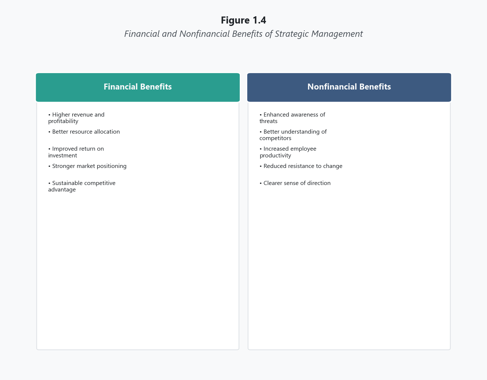
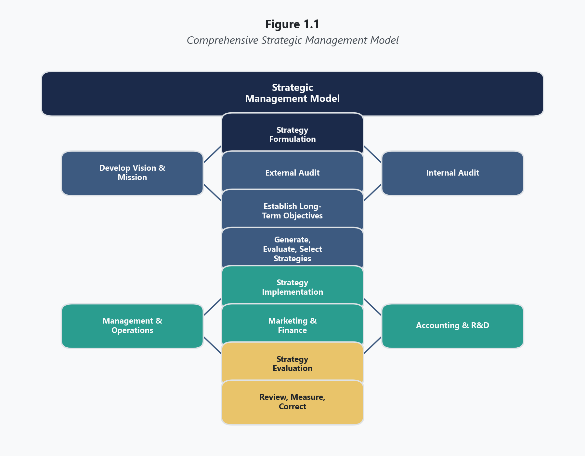
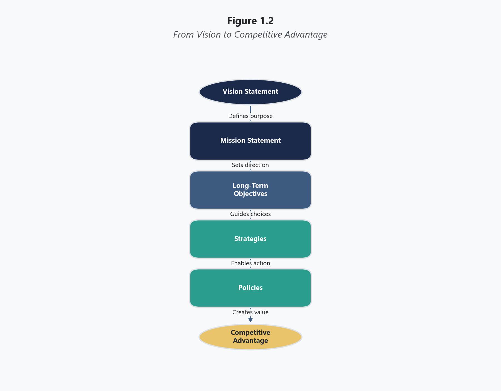
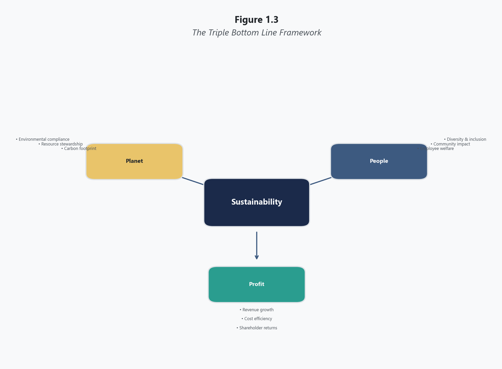
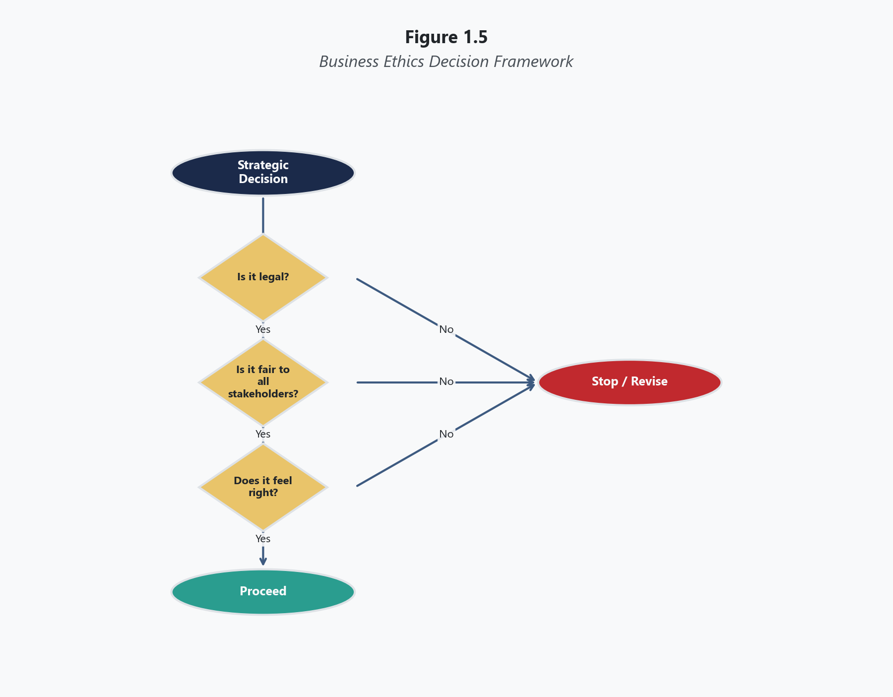

# Topic 1: Foundations of Strategic Management

Essential Questions

- What distinguishes strategic management from operational management, and why does the distinction matter for organizational leaders?
- How do the three stages of the strategic management process function as an integrated, iterative system rather than a linear sequence?
- What role do mission and vision statements play in constraining and directing strategic decision-making?
- Why is ethical reasoning inseparable from strategic management, and how do stewardship, sustainability, and stakeholder accountability shape strategic choices?
- How does the case analysis method develop the judgment required for strategic leadership?

---

## Opening

In January 2012, Kodak filed for Chapter 11 bankruptcy protection after more than a century as one of the most recognized brands in global consumer markets. At its peak in the late 1990s, the company employed over 145,000 people worldwide and commanded approximately two-thirds of the global film market (Mui, 2012). The irony embedded in Kodak's collapse is that the company's own engineer, Steven Sasson, invented the first digital camera in 1975. Kodak possessed the technological capability, the brand equity, the distribution infrastructure, and the financial resources to dominate the digital photography revolution. It possessed everything except a strategic management process capable of translating those assets into a coherent competitive response to an existential market disruption.

Kodak's failure was not a failure of resources, talent, or even awareness. Internal documents reveal that company leadership understood the threat digital technology posed to its film-based business model as early as the 1980s (Lucas & Goh, 2009). The failure was strategic: an inability to formulate a clear competitive response, implement the organizational changes that response required, and evaluate outcomes with sufficient honesty to correct course before the window of opportunity closed permanently. Kodak's leadership allowed short-term profitability from film sales to obscure the long-term strategic imperative of digital transformation. By the time the company committed fully to a digital strategy, competitors who had entered the market earlier had already established insurmountable advantages in cost structure, technological capability, and consumer adoption.

This pattern — possessing every advantage except the discipline to deploy those advantages strategically — recurs with uncomfortable frequency across industries and eras. It is the central problem that strategic management exists to address. Organizations do not fail because they lack resources. They fail because they lack the systematic process of analyzing their competitive environment, making deliberate choices about how to compete, executing those choices with organizational coherence, and honestly evaluating whether the choices are producing the intended results. This topic introduces that process, its core vocabulary, its ethical foundations, and the case analysis method you will use throughout this course to practice strategic thinking with real companies facing real decisions.

---

## Learning Objectives

By the end of this topic, you will be able to:

- Define **strategic management** and explain why it is critical for organizations of all types and sizes
- Describe the three stages of the strategic management process — formulation, implementation, evaluation — and identify the key activities within each stage
- Explain the **comprehensive strategic management model** and use it as a framework for organizing strategic analysis
- Define **competitive advantage** and explain how strategic management helps firms achieve and sustain it
- Identify who **strategists** are within an organization and describe their roles and responsibilities
- Discuss the relationship between intuition and analysis in effective strategic decision-making
- Articulate both the financial and non-financial benefits of practicing strategic management
- Identify common pitfalls in strategic planning and explain how to avoid them
- Define a **vision statement** and explain its role as the first step in strategic planning
- Define a **mission statement** and distinguish it from a vision statement using clear criteria
- Identify and explain the nine components of an effective mission statement
- Evaluate real-world mission statements for completeness using the nine-component framework
- Write a draft vision statement and mission statement for a given organization
- Define **business ethics** and explain why good ethics is good business in a strategic management context
- Explain the **triple bottom line** framework and its application to strategic decision-making
- Describe how ethical considerations apply to each of the three stages of strategic management
- Explain the **FCPA** and its implications for firms operating internationally
- Distinguish between utilitarian, rights-based, and justice-based approaches to ethical decision-making
- Explain the case method and describe the step-by-step process for preparing a comprehensive **case analysis**

---

## The Nature of Strategic Management

### What Strategic Management Is

**Strategic management** is the integrated process of analyzing an organization's competitive environment, formulating long-term strategic direction, implementing that direction across functional areas, and evaluating outcomes to ensure alignment between strategic intent and organizational performance. The discipline operates at the intersection of rigorous analysis and executive judgment, requiring leaders to synthesize quantitative data, competitive intelligence, organizational capability assessments, and stakeholder considerations into coherent courses of action that position the organization for sustained success.

What distinguishes strategic management from the broader category of management practice is its scope, time horizon, and organizational consequence. **Operational management** concerns itself with the efficient execution of existing processes — manufacturing products within quality specifications, delivering services within cost parameters, managing employee performance against established standards. These activities are essential, but they assume the fundamental strategic direction has already been established. Strategic management is the discipline that establishes that direction in the first place, and it does so by confronting questions that operational management cannot answer: In which markets should we compete? What capabilities must we build or acquire to win in those markets? How should we allocate finite resources among competing investment opportunities? When should we exit businesses that no longer align with our strategic direction?

The stakes attached to these questions explain why strategic management commands the attention of senior leadership rather than middle management. A production manager who optimizes a manufacturing process by three percent has improved organizational efficiency. A CEO who decides to exit manufacturing entirely and redirect the company's capital toward a services-based business model has altered the organization's fundamental competitive identity. Both decisions require competence. Only the second requires strategic management.

### What Strategic Management Is Not

Strategic management is not synonymous with **strategic planning**, although planning constitutes one component of the broader process. Strategic planning produces a document — a plan articulating objectives, initiatives, resource allocations, and timelines. Strategic management encompasses that planning activity but extends far beyond it to include the organizational mobilization required to execute the plan, the cultural and structural adjustments necessary to align the organization with its strategic direction, and the ongoing evaluation mechanisms that determine whether the strategy is achieving its intended outcomes.

This distinction matters because organizations routinely confuse planning with managing. A company that produces an elegant strategic plan, distributes it to senior leaders, and files it in a shared drive has engaged in strategic planning. It has not engaged in strategic management. Strategic management requires that the insights from the planning process permeate every functional decision the organization makes — from hiring priorities to capital expenditure approvals to marketing messaging to supplier selection. When planning and execution operate as disconnected activities, the result is what practitioners sometimes call the "strategy-execution gap," a condition in which the organization's stated strategic intent bears little resemblance to its actual competitive behavior (Sull et al., 2015).

Strategic management is also not a purely analytical exercise. The discipline employs numerous analytical tools — environmental scanning frameworks, capability assessments, portfolio models, competitive positioning matrices — and these tools produce valuable data. But data does not make decisions. Leaders make decisions, and they do so under conditions of uncertainty, incomplete information, competing stakeholder interests, and irreducible ambiguity about the future. The analytical tools of strategic management reduce uncertainty; they do not eliminate it.

### Strategists and Their Roles

**Strategists** are the individuals most responsible for an organization's success or failure. In most organizations, this includes the chief executive officer, the president, the board chair, and other senior leaders who possess the authority to commit organizational resources to long-term courses of action. However, strategic thinking is not the exclusive domain of the C-suite. Divisional managers, business unit leaders, and functional area heads all contribute to strategic management within their spheres of responsibility.

The chief executive officer typically bears ultimate accountability for strategic direction, but the most effective strategic management processes draw on perspectives from across the organizational hierarchy. A chief financial officer brings analytical discipline to resource allocation decisions. A chief marketing officer contributes market intelligence that shapes competitive positioning. A chief technology officer identifies emerging capabilities that may create or destroy competitive advantage. The board of directors provides governance oversight, ensuring that strategic decisions align with shareholder interests and institutional values. Effective strategy is not a solo performance. It is a coordinated effort among leaders who bring different forms of expertise to a shared analytical process.

### Intuition Versus Analysis

Effective strategic management integrates both intuition and analysis. Neither alone is sufficient. Analysis provides data, structure, and evidence-based reasoning. Intuition provides the pattern recognition, contextual judgment, and experiential wisdom that data alone cannot supply.

Early strategic management practice leaned heavily on analytical models — industry structure analysis, portfolio planning matrices, financial forecasting. These tools brought rigor to a discipline that had previously relied almost entirely on executive instinct. However, the pendulum can swing too far toward analysis, producing organizations that are data-rich but decision-poor. Managers who refuse to act until every variable is quantified often miss the strategic windows that reward timely commitment under uncertainty.

The most effective strategic leaders operate along a continuum between pure intuition and pure analysis, drawing on both as circumstances require. When reliable data exists and the decision timeline permits, analysis should dominate. When the competitive environment is shifting rapidly, data is incomplete, and delay carries significant cost, experienced intuition becomes more valuable. The strategic management process structures this integration by providing analytical frameworks that inform judgment without replacing it.

### Adapting to Change

Organizations must systematically monitor and adapt to changes in their external and internal environments. Markets shift. Technologies emerge. Regulations change. Consumer preferences evolve. Competitors enter and exit. Demographic patterns reshape demand. The organizations that survive over decades are not necessarily those with the most resources or the strongest current market positions. They are the organizations with strategic management processes that detect environmental changes early, interpret their implications accurately, and adjust strategic direction before the changes become crises.

This principle of continuous adaptation distinguishes strategic management from strategic planning conducted as a periodic event. Organizations that treat strategy as something they update every three to five years during an off-site retreat are engaging in episodic planning, not strategic management. The competitive environment does not pause between planning cycles.

### Benefits of Strategic Management

Research across multiple industries consistently demonstrates that organizations practicing systematic strategic management outperform those that do not, on both financial and non-financial dimensions (David & David, 2017).

**Figure 1.4**
*Financial and Nonfinancial Benefits of Strategic Management*

The financial benefits are measurable: organizations with formal strategic management processes tend to exhibit higher revenue growth, stronger profitability, and more effective resource utilization than comparable organizations without such processes. However, the non-financial benefits are equally significant and arguably more durable. Strategic management enhances communication across organizational levels by creating a shared vocabulary and a common analytical framework for discussing competitive challenges. It deepens understanding of competitive dynamics among managers who might otherwise focus exclusively on their functional responsibilities. It increases commitment to organizational objectives by involving managers in the process of setting those objectives. It strengthens the organization's ability to prevent problems through proactive environmental scanning rather than reactive crisis management.

The process benefits of strategic management — the organizational learning, cross-functional dialogue, and shared situational awareness that emerge from the process itself — are as important as the strategic outcomes the process produces. An organization can derive significant value from a strategic management process even when the resulting strategy proves imperfect, because the process itself builds organizational capability for future strategic challenges.

### Pitfalls in Strategic Planning

Strategic planning fails when organizations use it for the wrong purposes or execute it with insufficient commitment. Common pitfalls include using the planning process solely as a control mechanism rather than a genuine analytical exercise, conducting planning primarily to satisfy accreditation or regulatory requirements, failing to communicate the resulting plan beyond senior leadership, allowing the planning process to become so bureaucratic that it consumes more organizational energy than it produces, and substituting the plan itself for the management discipline required to execute it.

Perhaps the most damaging pitfall is the absence of top management support. When senior leaders delegate strategic planning to staff functions, fail to participate meaningfully in the analytical process, or visibly disregard the plan's priorities in their resource allocation decisions, the organization quickly learns that strategic planning is a ceremonial exercise rather than a genuine management commitment. Once that perception takes hold, the planning process loses its ability to shape organizational behavior.

---

## The Comprehensive Strategic Management Model

The **comprehensive strategic management model** provides a visual framework showing the flow from vision and mission development through external and internal analysis, strategy formulation, strategy implementation, and strategy evaluation, with feedback loops connecting each stage to the others. This model serves as the backbone of this course. Every tool, framework, and case analysis you encounter operates within this model's logic.

**Figure 1.1**
*Comprehensive Strategic Management Model*

The model illustrates several critical features of the strategic management process. First, it begins with vision and mission — the organization's foundational identity drives everything that follows. Second, external analysis (opportunities and threats) and internal analysis (strengths and weaknesses) feed simultaneously into strategy formulation, ensuring that strategic choices reflect both environmental reality and organizational capability. Third, implementation translates formulated strategies into organizational action through annual objectives, policies, and resource allocation. Fourth, evaluation reviews performance and feeds back into every prior stage, creating a continuous improvement cycle. Fifth, the arrows connecting stages flow in both directions, reflecting the iterative nature of the process.

Understanding this model is not optional. It is the organizing framework you will use to connect every analytical tool to its purpose within the broader strategic management process. When you construct an EFE Matrix, you are performing external analysis. When you build an IFE Matrix, you are performing internal analysis. When you develop a QSPM, you are evaluating strategic alternatives during formulation. When you create pro forma financial statements, you are projecting implementation outcomes. Each tool has a specific location within this model, and understanding that location is essential to using the tool correctly.

---

## The Strategic Management Process

### Strategy Formulation

**Strategy formulation** encompasses all analytical and decision-making activities that occur before the organization commits resources to a particular strategic direction. The stage begins with establishing or reaffirming the organization's foundational strategic identity through its vision statement and mission statement, proceeds through external and internal analysis, and concludes with the generation, evaluation, and selection of strategic alternatives.

Formulation demands both analytical rigor and creative judgment. The analytical component involves systematic data collection and structured frameworks — industry analysis, capability assessment, competitor profiling. The creative component involves imagining strategic possibilities that the data alone does not suggest — new market entries, innovative business models, unconventional competitive approaches. Organizations that formulate strategy using only analysis tend to produce strategies that are defensible but uninspired. Organizations that formulate strategy using only intuition tend to produce strategies that are imaginative but disconnected from competitive reality. The best formulation integrates both.

### Strategy Implementation

**Strategy implementation** converts strategic decisions into organizational action. Implementation is where the majority of strategies fail. Research across multiple decades consistently indicates that between 60 and 90 percent of strategic initiatives do not achieve their intended objectives, and the predominant cause is implementation failure rather than formulation error (Candido & Santos, 2015).

Effective implementation requires alignment across multiple organizational dimensions simultaneously. **Annual objectives** must translate long-range strategic goals into measurable near-term targets. Functional-area **policies** must provide decision-making guidance that steers day-to-day operations in the direction the strategy requires. Organizational structure must support rather than obstruct the cross-functional coordination the strategy demands. Resource allocation must reflect strategic priorities rather than historical precedent or political influence. Incentive systems must reward behaviors that advance the strategy and discourage behaviors that undermine it. And leadership must communicate the strategic direction with sufficient clarity and consistency that employees across every level of the organization understand how their individual work connects to the organization's strategic objectives.

### Strategy Evaluation

**Strategy evaluation** is the discipline of measuring strategic performance, reviewing the assumptions underlying the current strategy, and making corrective adjustments when results diverge from objectives. Evaluation encompasses three distinct activities.

The first is reviewing the external and internal factors that informed the original strategic formulation. Competitive environments evolve continuously, and the assumptions that supported a strategic choice at the time of formulation may no longer hold. The second activity is measuring organizational performance against the objectives established during formulation and refined during implementation. This measurement requires both quantitative metrics and qualitative assessments of progress toward objectives that resist numerical measurement. The third activity is taking corrective action when the first two activities reveal problems. Corrective action may range from minor tactical adjustments to fundamental strategic redirection that cycles the organization back to the formulation stage.

The willingness to take corrective action, particularly when that action requires acknowledging that a prior strategic decision was wrong, represents one of the most significant tests of leadership character in the strategic management process.

---

## Competitive Advantage as the Central Objective

The concept of **competitive advantage** — a condition in which an organization outperforms its rivals on dimensions that customers value and that competitors cannot easily replicate — functions as both the objective of strategic management and the standard against which strategic outcomes are measured. Every stage of the strategic management process is ultimately oriented toward creating, sustaining, or renewing competitive advantage.

Competitive advantage arises from two fundamental sources. **Cost advantage** exists when an organization delivers comparable value to customers at a lower cost than competitors, enabling either lower pricing or higher margins at equivalent price points. **Differentiation advantage** exists when an organization delivers distinctive value that customers are willing to pay a premium to obtain, whether through product quality, brand reputation, customer service, innovation, or other dimensions of perceived superiority (Porter, 1985).

The critical insight for strategic management practitioners is that competitive advantage is inherently temporary. Competitors observe successful strategies and develop imitative or substitute responses. Technologies evolve and render previously valuable capabilities obsolete. Customer preferences shift in response to cultural, demographic, and economic changes. A **sustained competitive advantage** endures longer than a temporary one — typically because the underlying capabilities are difficult for competitors to duplicate — but even sustained advantages erode over time without deliberate renewal through the strategic management process.

---

## Vision Statements and Mission Statements

**Figure 1.2**
*From Vision to Competitive Advantage*

### Vision Statements

A **vision statement** answers the question: What do we want to become? It describes the organization's desired future state — a short, aspirational declaration of what the organization is striving toward over a defined time horizon. The vision creates directional pull, aligning organizational energy toward a shared aspiration rather than allowing individual business units or functional areas to pursue divergent objectives.

Effective vision statements are developed collaboratively rather than imposed by a single leader. They are broad enough to accommodate multiple strategic paths but specific enough to provide meaningful direction. They are future-oriented, describing what the organization aspires to become rather than what it currently is. The vision serves as the foundation upon which the mission statement builds.

The importance of vision in organizational life is not a modern management invention. Proverbs 29:18 (NIV) observes that "where there is no vision, the people perish" — a principle that translates directly into strategic practice. Organizations without a compelling vision do not simply stagnate; they fragment. Individual leaders pursue competing priorities, resources scatter across uncoordinated initiatives, and the organization loses the directional coherence that separates strategic movement from organizational drift.

### Mission Statements

A **mission statement** answers the question: What is our business? Sometimes called a **creed** or statement of purpose, it declares the organization's reason for being — why it exists, whom it serves, what it provides, and what distinguishes it from other organizations operating in the same competitive space.

The distinction between vision and mission is a source of consistent confusion among students and practitioners alike. The vision is developed first and is broad and future-oriented: it describes what the organization wants to become. The mission is more concrete and present-oriented: it identifies the organization's current scope, purpose, and identity. Vision equals "become." Mission equals "are" and "do."

A well-constructed mission statement functions not as a marketing slogan but as a strategic constraint — it defines the boundaries within which the organization will pursue competitive advantage and the boundaries beyond which it will not venture regardless of apparent opportunity.

### The Nine Components of an Effective Mission Statement

Research in strategic management identifies nine components that a comprehensive mission statement should address (David & David, 2017):

**Table 1.1**
*Nine Components of an Effective Mission Statement*

| Component | Question It Answers | Example |
|-----------|-------------------|---------|
| Customers | Who are our customers? | "We serve health-conscious consumers..." |
| Products or Services | What are our major products or services? | "...through organic food products..." |
| Markets | Geographically, where do we compete? | "...across North America..." |
| Technology | Is the firm technologically current? | "...using sustainable farming technology..." |
| Survival, Growth, and Profitability | Is the firm committed to financial soundness? | "...ensuring long-term financial viability..." |
| Philosophy | What are the basic beliefs, values, and aspirations? | "...guided by environmental stewardship..." |
| Self-Concept | What is the firm's distinctive competence? | "...as the recognized leader in organic standards..." |
| Public Image | Is the firm responsive to community concerns? | "...committed to transparent sourcing practices..." |
| Concern for Employees | Are employees valued? | "...with a workforce we invest in and respect." |

Not every mission statement addresses all nine components explicitly, but the framework provides a diagnostic tool for evaluating whether a mission statement is comprehensive or superficial. A mission statement that addresses only two or three components leaves significant strategic ambiguity about the organization's identity, scope, and commitments.

### Evaluating Mission Statements

The nine-component framework functions as an evaluation tool. When you examine a real-world mission statement, systematically check each component: Does the statement identify customers? Does it specify products or services? Does it indicate geographic markets? Does it reference technology? Does it address financial commitments? Does it articulate philosophy? Does it convey a **self-concept** — the organization's understanding of its own **distinctive competence**? Does it address public image? Does it mention employees?

Many mission statements that sound inspirational under casual review prove strategically hollow when subjected to this analysis. A mission statement that reads "to be the best" addresses none of the nine components and provides no strategic guidance whatsoever. A statement that reads "to provide the highest-quality organic food products to health-conscious consumers in North America while maintaining financial sustainability and investing in our workforce" addresses at least five components and creates meaningful strategic boundaries.

### Developing Vision and Mission Statements

Vision and mission development is not a top-down exercise in which the CEO drafts a statement and distributes it for endorsement. Effective development is collaborative and iterative. The process typically involves asking multiple managers to read articles on vision and mission statements, draft their own versions independently, and then convene with a facilitator who merges contributions, identifies common themes, resolves conflicting priorities, and iterates through multiple revisions until the leadership team reaches genuine consensus.

This process matters not only because it produces a better statement but because it builds organizational commitment to the statement's implications. A mission statement imposed by one leader is easily ignored by others. A mission statement co-created by the leadership team carries shared ownership, and leaders who helped shape the statement are far more likely to use it as an actual decision-making filter when evaluating strategic alternatives.

### Stakeholder Balance

A mission statement must balance the interests of multiple **stakeholders** — employees, customers, shareholders, suppliers, communities, and others who have a legitimate stake in the organization's behavior and outcomes. No single stakeholder group should dominate the mission statement to the exclusion of others. The quality of a mission statement that successfully balances diverse interests is sometimes called its **reconciliatory** quality — its ability to reconcile competing claims into a coherent organizational identity.

This stakeholder balance is not merely aspirational. It reflects the practical reality that organizations depend on the continued cooperation of multiple constituencies. An organization that writes its mission exclusively around shareholder return may generate short-term financial performance but lose the employee commitment, customer loyalty, or community support on which long-term value creation depends. A **customer orientation** — identifying customers and their needs as a central mission component — is essential, but it must coexist with attention to the other eight components.

### Vision and Mission as Strategic Drivers

The vision-to-strategy cascade illustrates how these foundational statements drive the entire strategic management process. Vision informs mission. Mission establishes the boundaries for long-term objectives. **Long-term objectives** — specific results sought beyond one year in pursuing the mission — shape the **strategies** selected to achieve them. Strategies translate into annual objectives, and annual objectives are supported by **policies** — the guidelines, rules, and procedures that govern day-to-day decisions. This cascade means that a poorly constructed vision or mission statement does not just fail as a communication device. It corrupts every downstream strategic decision by providing inadequate guidance about what the organization is trying to accomplish and where it will and will not compete.

---

## Application Example 1 — Southwest Airlines

Southwest Airlines has sustained profitability for over forty consecutive years in an industry where most competitors cycle through periods of significant financial loss. The company's strategic management process illustrates how formulation, implementation, and evaluation function as a coherent system when leadership maintains disciplined alignment across all three stages.

Southwest's formulation centered on a deliberate strategic choice to compete as a low-cost, high-frequency carrier serving short-haul domestic routes. This formulation constrained the company's strategic alternatives in ways that initially appeared to limit growth potential — no international routes, no first-class seating, no assigned seats, no interline baggage transfers, no hub-and-spoke routing. However, each constraint reinforced operational simplicity, which in turn supported the cost structure that constituted Southwest's primary competitive advantage (Gittell, 2005).

Implementation at Southwest translated this formulation into organizational systems with unusual consistency. The company operates a single aircraft type (the Boeing 737), which reduces maintenance complexity, training costs, and spare parts inventory. Gate turnaround times averaging twenty-five minutes — roughly half the industry standard — maximize aircraft utilization, the single most important cost driver in airline economics. Employee compensation structures emphasize profit-sharing, aligning individual incentives with organizational strategic performance.

Southwest's evaluation discipline manifests in its consistent refusal to deviate from its strategic formulation despite repeated external pressure to do so. When competitors introduced premium services, loyalty programs, and international routes, Southwest evaluated these alternatives against its core strategic logic and repeatedly declined to pursue them. This disciplined evaluation demonstrates the integrative relationship between evaluation and formulation that characterizes effective strategic management.

---

## Application Example 2 — Nokia

Nokia's trajectory from global mobile phone market leader to near-irrelevance provides a contrasting illustration of strategic management failure across all three stages. In 2007, Nokia commanded approximately 49.4 percent of global smartphone market share (Statista, 2023). By 2013, the company had sold its mobile phone division to Microsoft for approximately $7.2 billion.

Nokia's formulation failure centered on a critical misreading of the competitive environment. When Apple introduced the iPhone in 2007, Nokia's leadership assessed the device primarily as a hardware product competing on specifications rather than as a software platform competing on ecosystem integration, application availability, and user experience. This analytical error produced a formulation that emphasized hardware iteration within Nokia's existing Symbian operating system rather than a fundamental strategic pivot toward software platform development (Vuori & Huy, 2016).

Nokia's implementation failures compounded its formulation error. The company's organizational structure — divided into competing product divisions with limited cross-functional coordination — prevented the integrated response that a platform-based strategy would have required. Internal communication research has documented that Nokia's middle managers systematically filtered negative competitive intelligence before it reached senior leadership, creating an information environment in which strategic evaluation operated on incomplete and optimistic data (Vuori & Huy, 2016).

Nokia's evaluation failure completed the cycle. By the time senior leadership acknowledged the severity of the competitive threat, the company had lost three years of development time, and the smartphone market had consolidated around two platforms that Nokia could no longer realistically challenge.

---

## Business Ethics and Strategic Management

### Why Good Ethics Is Good Business

**Business ethics** consists of the principles of conduct that guide decision-making within organizations. Ethics is not a separate consideration that sits alongside strategic management. It is woven into every stage of the process. Every strategic decision — which markets to enter, which suppliers to use, which products to discontinue, which employees to retain, which communities to serve — carries ethical implications that affect stakeholders beyond the organization's shareholders.

The practical case for ethical behavior rests on a foundation of trust. Organizations that consistently act ethically build trust with customers, employees, investors, regulators, and communities. That trust functions as a strategic asset: it reduces transaction costs, attracts talent, strengthens brand equity, and creates resilience during periods of adversity. Organizations that violate trust through unethical behavior — deceptive marketing, environmental negligence, labor exploitation, financial fraud — incur costs that frequently exceed whatever short-term gains the unethical behavior produced. Reputation, once damaged, is extraordinarily expensive to repair and sometimes impossible to recover.

### Code of Business Ethics

A **code of business ethics** is a written document that specifies the ethical standards and behavioral expectations governing organizational conduct. An effective code addresses specific situations employees are likely to encounter, provides clear guidance for resolving ethical ambiguities, and establishes accountability mechanisms for violations.

However, a code of ethics is only as effective as the organizational culture that supports it. A code that is printed, distributed, and filed becomes wallpaper — visible but ignored. A code that is lived by senior leadership, reinforced through training, referenced in decision-making conversations, and enforced through genuine consequences for violations becomes an organizational norm that shapes behavior at every level. The distinction between a performative code and a practiced code is one of the most reliable indicators of an organization's true ethical character.

### Environmental Sustainability

**Environmental sustainability** refers to the extent to which an organization's operations protect rather than harm the natural environment. What was once treated as a compliance issue — meeting minimum regulatory requirements for emissions, waste disposal, and resource consumption — has evolved into a strategic imperative that affects competitive positioning, consumer preference, investor behavior, and regulatory risk.

**Corporate social responsibility (CSR)** extends beyond environmental considerations to encompass actions an organization takes beyond its legal requirements for the benefit of society. These actions may include community investment, ethical supply chain management, employee volunteerism programs, and philanthropic commitments.

### The Triple Bottom Line

The **triple bottom line** framework evaluates organizational success across three dimensions: People, Planet, and Profit. Traditional financial accounting measures only the profit dimension. The triple bottom line argues that long-term organizational viability requires attention to social impact (People) and environmental impact (Planet) alongside financial performance.

**Figure 1.3**
*The Triple Bottom Line Framework*

Organizations increasingly produce **sustainability reports** that document their performance across **ESG** criteria — Environmental, Social, and Governance factors. ESG reporting has migrated from a voluntary public relations exercise to a strategic requirement, as investors, regulators, and customers use ESG metrics to evaluate organizational risk and commitment to sustainable practices.

### Ethics Across All Three Stages

Ethical considerations apply at every stage of the strategic management process. During formulation, ethics constrains the range of acceptable strategies — an organization committed to ethical conduct will not pursue strategies that depend on deceptive practices, environmental exploitation, or unfair labor conditions, even when such strategies might be profitable. During implementation, ethics governs how the organization treats people affected by strategic changes — employees displaced by restructuring, communities affected by facility closures, suppliers subjected to aggressive cost reduction demands. During evaluation, ethics requires honest measurement — organizations that manipulate performance data, suppress unfavorable metrics, or claim results they have not achieved undermine the evaluation process and expose stakeholders to unacknowledged risk.

### The Foreign Corrupt Practices Act

The **Foreign Corrupt Practices Act (FCPA)** is a United States federal law that prohibits American companies and their agents from bribing foreign government officials to obtain or retain business. The FCPA carries severe penalties including substantial fines and imprisonment for individual violators. For organizations operating internationally, compliance with the FCPA is not optional, and the strategic implications are significant: business practices that are common in certain international markets may constitute criminal violations under U.S. law. Strategic leaders must build compliance awareness into their international expansion strategies and ensure that competitive pressures do not override legal and ethical obligations.

### Ethical Decision-Making Frameworks

Strategic leaders benefit from structured approaches to ethical reasoning. Three frameworks are commonly applied in business contexts:

**Figure 1.5**
*Business Ethics Decision Framework*

**Utilitarianism** evaluates ethical decisions based on consequences: the right action is the one that produces the greatest overall good for the greatest number of people. This framework is intuitive and widely used in business, but it carries a significant limitation — it can justify harm to a minority if that harm produces benefits for a majority.

**Rights-based ethics** holds that certain fundamental rights — life, liberty, privacy, property, dignity — cannot be violated regardless of the consequences. Under this framework, an action that violates a fundamental right is wrong even if it produces net positive outcomes.

**Justice-based ethics** focuses on fairness and equitable distribution of benefits and burdens. This framework asks whether the consequences of a decision are distributed fairly among affected parties or whether some stakeholders bear disproportionate costs so that others may benefit disproportionately.

Effective ethical reasoning often involves applying all three frameworks to the same situation and examining where they converge and diverge. When all three frameworks point to the same conclusion, ethical confidence is high. When they conflict — when the utilitarian calculus favors one action, but that action violates someone's fundamental rights — the ethical challenge deepens, and the strategic leader must exercise moral judgment that no framework can fully automate.

### Whistleblowing and Ethical Culture

**Whistleblowing** — the act of reporting unethical or illegal organizational activities — represents both a protection mechanism and a cultural indicator. Organizations that retaliate against whistleblowers signal that ethical compliance is performative rather than genuine. Organizations that protect and even encourage internal reporting signal that ethical integrity takes priority over institutional self-protection. The strategic implication is direct: an organization's posture toward whistleblowing shapes whether ethical problems surface early enough to address or remain hidden until they produce crises.

---

## The Case Analysis Method

### Why Cases

The **case analysis** method is the primary pedagogical tool for developing strategic management judgment. A case presents a real company in a real competitive situation, requiring you to analyze the company's strategic position, identify the core problems or opportunities, generate strategic alternatives, evaluate those alternatives using the analytical tools of the course, and recommend a course of action with supporting rationale.

The case method works because strategic management is a practice discipline. You cannot learn strategy by memorizing frameworks any more than you can learn surgery by reading about scalpels. The frameworks provide analytical structure, but judgment — the ability to weigh competing considerations, tolerate ambiguity, and commit to a course of action under uncertainty — develops only through repeated practice with realistic scenarios. Cases provide that practice.

### Preparing a Case Analysis

Preparing a comprehensive case analysis follows a structured process:

1. Read the case thoroughly at least twice — once for general understanding, once for analytical detail. Identify the company's current strategy, its competitive position, and the decision the case presents.

2. Conduct an external analysis using the tools this course provides — industry analysis, competitive assessment, identification of key **external opportunities** and **external threats** affecting the organization.

3. Conduct an internal analysis — evaluating the organization's **internal strengths** and **internal weaknesses** across management, marketing, finance, production, research and development, and information systems.

4. Construct a **SWOT analysis** — a framework that synthesizes your external and internal analyses by identifying Strengths, Weaknesses, Opportunities, and Threats. SWOT items should be specific and actionable, not vague generalizations.

5. Generate strategic alternatives — based on your SWOT analysis and the company's current strategic position, identify two to four viable courses of action the organization could pursue.

6. Evaluate alternatives systematically — using a **decision matrix** or similar tool, score each alternative against criteria derived from your analysis. Criteria may include feasibility, cost, risk, alignment with mission, competitive impact, and ethical acceptability.

7. Select and defend a recommendation — choose the alternative that your analysis supports most strongly and prepare a clear rationale for that recommendation.

8. Prepare projected (**pro forma**) financial statements showing the expected financial impact of your recommendation. Pro forma statements typically include a projected income statement, balance sheet, and cash flow statement reflecting how the recommended strategy would affect the company's financial position.

### The Written Case Report

A written case analysis report follows a standard structure:

- **Executive summary** — a brief overview summarizing key findings and the recommended strategy
- Company background — history, current position, and strategic context
- External analysis — opportunities and threats with supporting data
- Internal analysis — strengths and weaknesses with supporting data
- SWOT matrix — visual synthesis of key factors
- Strategic alternatives — options identified and evaluated
- Recommendation — selected strategy with supporting rationale
- **Implementation plan** — actions, timelines, responsible parties, and resources required
- Financial projections — pro forma statements demonstrating expected financial impact

### The Oral Case Presentation

Oral case presentations develop a critical professional competency: the ability to communicate strategic recommendations clearly, defend analytical conclusions under questioning, and persuade decision-makers. Effective oral presentations use clear visuals that support rather than replace verbal analysis, maintain disciplined time management, demonstrate team coordination when presented in groups, and show the ability to respond to probing questions without abandoning analytical rigor.

### Research Beyond the Case

Cases provide a snapshot of a company at a particular moment. Effective case analysis supplements the case data with independent research on current industry trends, recent competitor actions, regulatory developments, and the company's actual post-case trajectory. This supplemental research strengthens the analytical foundation and often reveals contextual factors that the case itself does not address.

---

## Ethical Considerations

Strategic management is not a morally neutral discipline. Every strategic decision allocates resources, creates winners and losers, and reflects assumptions about what an organization owes to its various stakeholders. The analytical tools of strategic management can identify the most profitable course of action, but they cannot determine whether the most profitable course of action is the right one. That determination requires ethical reasoning that the tools themselves do not provide.

The concept of **stewardship** offers a framework for integrating ethical reasoning into strategic management practice. Stewardship begins with the recognition that organizational resources — financial capital, human talent, market position, community trust, environmental capacity — are entrusted rather than owned. The leader who views organizational resources as personal assets to be exploited for maximum return makes different strategic decisions than the leader who views those same resources as a trust to be managed faithfully on behalf of multiple stakeholders across multiple time horizons.

James 1:5 (NIV) speaks directly to the posture required for strategic leadership: "If any of you lacks wisdom, let him ask of God, who gives to all generously and without reproach, and it will be given to him." Strategic management requires wisdom — not merely intelligence, not merely analytical skill, but the capacity to discern what is right when the data is ambiguous, the stakeholders are conflicting, and the consequences are irreversible. The Christian strategic leader operates with the confidence that wisdom is available and the humility to acknowledge that every strategic decision carries moral weight beyond what any matrix or model can capture.

This posture does not produce easy answers. It produces leaders who ask harder questions — who interrogate not only whether a strategy will work but whether it should be pursued, who consider not only shareholder return but human consequence, who measure success not only in market share but in faithfulness to the responsibilities entrusted to their care.

---

## Conclusion

The discipline of strategic management provides organizational leaders with a systematic process for navigating competitive complexity that intuition, experience, and operational competence alone cannot reliably address. Kodak's collapse and Nokia's displacement from global market leadership demonstrate that neither technological capability nor market dominance can substitute for the integrated practice of strategic formulation, implementation, and evaluation. Southwest Airlines' sustained profitability across four decades in a notoriously difficult industry demonstrates the opposite — that disciplined strategic management can transform deliberate constraints into durable competitive advantages when the three stages of the process operate as a coherent, continuously iterating system.

The foundational vocabulary introduced in this topic — strategic management, strategy formulation, strategy implementation, strategy evaluation, mission statement, vision statement, competitive advantage, and stewardship — constitutes the conceptual infrastructure upon which every subsequent analytical tool and strategic framework in this course depends. The nine components of mission statement analysis provide a diagnostic tool you will apply repeatedly when evaluating organizations. The ethical frameworks — utilitarian, rights-based, and justice-based reasoning, along with the triple bottom line and ESG criteria — ensure that strategic analysis never operates in a moral vacuum. And the case analysis method provides the structured practice environment where these concepts, tools, and ethical commitments come together in the messy, ambiguous, consequential work of strategic leadership.

The strategic management process determines how organizational resources are allocated, which stakeholders benefit, which bear costs, and what kind of organization emerges from the accumulated weight of strategic choices made over time. Leaders who practice strategic management as an act of faithful stewardship — with rigorous analysis, honest evaluation, and genuine concern for the human consequences of strategic decisions — produce organizations worthy of the trust their stakeholders extend.

---

## For Further Reflection

1. Identify an organization you have worked for or observed closely. At which stage of the strategic management process — formulation, implementation, or evaluation — did that organization most consistently struggle, and what were the observable consequences of that weakness?

2. Southwest Airlines' strategic success is partly attributable to its disciplined refusal to pursue apparently attractive opportunities that conflicted with its core strategic logic. Identify a situation in your professional or personal experience where saying no to an attractive option proved more strategically important than saying yes. What made that discipline difficult?

3. Select a company whose mission statement is publicly available. Evaluate that mission statement against the nine-component framework. Which components are present? Which are missing? How would you revise the statement to address any gaps, and what strategic implications would those revisions carry?

4. The chapter argues that competitive advantage is inherently temporary. If this is true, what does it imply about the relative importance of the three stages of the strategic management process? Should organizations invest more heavily in formulation, implementation, or evaluation?

5. Consider the three ethical frameworks — utilitarian, rights-based, and justice-based. Identify a strategic decision (real or hypothetical) where these frameworks would produce different recommendations. How should a leader navigate that conflict?

---

## Knowledge Check

### Multiple Choice

**Question 1 [Blooms: Analyze]:**
Kodak invented the digital camera in 1975 but failed to commercialize digital photography effectively before competitors established dominant market positions. Which stage of the strategic management process most directly accounts for this failure?

A) Strategy evaluation, because Kodak failed to measure its financial performance accurately
B) Strategy formulation, because Kodak failed to translate its awareness of digital disruption into a coherent competitive response
C) Strategy implementation, because Kodak lacked the technical capability to manufacture digital cameras
D) Strategy evaluation, because Kodak's board of directors did not meet frequently enough

*Correct Answer: B*
*Rationale: Kodak was aware of the digital threat and possessed the technical capability to respond, but failed to formulate a strategic direction that addressed the disruption. Option C is factually incorrect — Kodak invented the technology. Options A and D misidentify the stage and the nature of the failure.*

**Question 2 [Blooms: Analyze]:**
Southwest Airlines operates only Boeing 737 aircraft, while most competitors operate multiple aircraft types. How does this operational decision relate to Southwest's strategic management process?

A) It is an implementation decision that directly supports the cost-advantage strategy formulated at the corporate level
B) It is a formulation decision that determines Southwest's competitive positioning
C) It is an evaluation metric used to measure operational efficiency
D) It is an operational management decision unrelated to strategic management

*Correct Answer: A*
*Rationale: The single-aircraft-type decision is an implementation mechanism that translates Southwest's cost-leadership formulation into operational reality by reducing maintenance, training, and inventory costs. Option B confuses implementation with formulation. Option C misidentifies it as a measurement tool. Option D incorrectly excludes it from strategic management.*

**Question 3 [Blooms: Analyze]:**
A company's mission statement reads: "To provide the highest-quality organic food products to health-conscious consumers in North America." Using the nine-component framework, which components does this mission statement address?

A) Customers, products, markets, and self-concept — four of the nine components
B) Customers, products, and markets — three of the nine components
C) All nine components are addressed implicitly
D) Only the products component is clearly addressed

*Correct Answer: B*
*Rationale: The statement identifies customers (health-conscious consumers), products (organic food products), and markets (North America). It does not address technology, survival/growth/profitability, philosophy, self-concept, public image, or concern for employees. The qualifier "highest-quality" gestures toward self-concept but does not articulate a distinctive competence. Option A overcounts. Option C incorrectly assumes implicit coverage. Option D undercounts.*

**Question 4 [Blooms: Analyze]:**
A pharmaceutical company discovers that its best-selling drug produces significant side effects that current regulations do not require disclosure about. A utilitarian analysis suggests that the drug's health benefits for millions of patients outweigh the side effects experienced by thousands. A rights-based analysis suggests that patients have a fundamental right to full information about side effects regardless of net benefit calculations. Which statement best describes the strategic implication of this conflict?

A) The company should follow the utilitarian analysis because it maximizes overall benefit
B) The company should follow the rights-based analysis because patient rights are absolute
C) The conflict between frameworks reveals that the strategic decision carries ethical complexity requiring leadership judgment beyond what any single framework can resolve
D) The company should follow whichever framework produces the most profitable outcome

*Correct Answer: C*
*Rationale: When ethical frameworks produce conflicting guidance, the conflict itself is informative — it reveals genuine moral complexity that requires judgment. Options A and B each adopt one framework without acknowledging the legitimate insight of the other. Option D reduces ethics to profit maximization, which is not ethical reasoning at all.*

**Question 5 [Blooms: Analyze]:**
An organization produces a detailed strategic plan every three years but does not systematically monitor competitive changes between planning cycles. A new competitor enters the market eighteen months after the plan was finalized, capturing 20 percent of market share before the organization responds. This scenario illustrates which pitfall of strategic management?

A) Failure to distinguish between strategic planning and strategic management — the organization treated planning as an event rather than a continuous process
B) Excessive reliance on analysis over intuition in the formulation stage
C) Implementation failure due to inadequate resource allocation
D) Evaluation failure due to manipulated performance data

*Correct Answer: A*
*Rationale: The organization confused strategic planning (producing a periodic document) with strategic management (continuous environmental monitoring, formulation, implementation, and evaluation). The three-year cycle created a gap in environmental scanning that allowed a competitive threat to develop undetected. Options B, C, and D misidentify the nature of the failure.*

**Question 6 [Blooms: Analyze]:**
Nokia's middle managers systematically filtered negative competitive intelligence before it reached senior leadership during the smartphone transition. This behavior most directly undermined which stage of the strategic management process?

A) Strategy formulation, because senior leaders lacked accurate external analysis data
B) Strategy implementation, because middle managers were not executing their assigned responsibilities
C) Strategy evaluation, because the filtering prevented honest assessment of the current strategy's effectiveness against competitive threats
D) All three stages equally, because information filtering affects every organizational function

*Correct Answer: C*
*Rationale: The filtering directly undermined evaluation by preventing senior leaders from accurately reviewing the external factors underlying the current strategy and measuring competitive performance. While the filtering eventually affected formulation, its primary impact was on the evaluation process that should have triggered earlier strategic reassessment.*

**Question 7 [Blooms: Analyze]:**
A company's vision statement describes becoming "the most trusted name in sustainable fashion by 2030." Its current supply chain relies on overseas manufacturers with documented labor violations. An external analysis identifies growing consumer demand for ethically sourced clothing. An internal analysis reveals that transitioning to verified ethical suppliers would increase production costs by 22 percent. What does this situation reveal about the relationship between vision, external analysis, and internal analysis in formulation?

A) The vision should be abandoned because internal cost constraints make it unachievable
B) The external analysis supports the vision's strategic direction, but the internal analysis reveals a capability gap that formulation must address before implementation can succeed
C) The internal analysis is irrelevant because the vision takes priority over cost considerations
D) The external and internal analyses contradict each other, making strategic formulation impossible

*Correct Answer: B*
*Rationale: Formulation requires synthesizing vision, external opportunities, and internal realities. The external environment supports the vision, but the internal analysis identifies a cost structure gap that must be addressed through supplier development, pricing strategy, phased transition, or other mechanisms. Option A abandons strategy at the first obstacle. Option C ignores internal constraints. Option D mischaracterizes the relationship.*

**Question 8 [Blooms: Analyze]:**
A manufacturing company's code of ethics prohibits environmental contamination beyond regulatory limits. The company discovers that its wastewater treatment process, while technically compliant with current regulations, releases chemicals that independent research has linked to health risks in the surrounding community. A utilitarian analysis suggests upgrading treatment would cost $2.3 million annually while benefiting approximately 15,000 residents. Under a justice-based framework, which additional consideration becomes most relevant?

A) Whether the $2.3 million cost would reduce shareholder dividends
B) Whether the health risks are distributed disproportionately among low-income residents who lack the resources to relocate
C) Whether competitors face similar wastewater challenges
D) Whether the company's stock price would decline if the issue became public

*Correct Answer: B*
*Rationale: Justice-based ethics focuses on fairness and equitable distribution of benefits and burdens. The most relevant justice question is whether vulnerable populations bear disproportionate health risks from the company's operations while lacking the resources to avoid those risks. Options A and D reduce the question to financial impact. Option C is relevant to competitive analysis but not to justice-based ethical reasoning.*

**Question 9 [Blooms: Analyze]:**
A hospital system formulates a strategy to become the region's leading provider of cardiac care. During implementation, the system discovers that its two largest hospitals have competing cardiology departments that refuse to share patient referrals, coordinate research, or standardize treatment protocols. This situation illustrates which common implementation challenge?

A) Insufficient external analysis during the formulation stage
B) Organizational structure creating obstacles to the cross-functional coordination required by the strategy
C) Inadequate financial resources to support the cardiac care initiative
D) Failure to establish a vision statement before pursuing the strategy

*Correct Answer: B*
*Rationale: The competing departmental structures directly obstruct the coordination required to implement a system-wide cardiac care leadership strategy. This is a classic implementation failure in which organizational structure conflicts with strategic direction.*

**Question 10 [Blooms: Analyze]:**
A student preparing a case analysis identifies "poor management" as a weakness in the SWOT matrix and "improve management" as a strategy. What is the fundamental analytical problem with this approach?

A) The weakness and strategy are too vague to guide strategic action — SWOT items must be specific and actionable, not vague generalizations
B) Management quality is not an appropriate SWOT category
C) Weaknesses should not be addressed through strategies
D) The student should have placed this item in the threats category instead

*Correct Answer: A*
*Rationale: Effective SWOT analysis requires specificity. "Poor management" could mean inadequate succession planning, weak financial controls, low employee retention, or dozens of other specific problems, each requiring a different strategic response. Similarly, "improve management" is not a strategy — it is a wish. The case method demands analytical depth, not surface-level labeling. Options B, C, and D misidentify the nature of the problem.*

### Critical Thinking

**Scenario 1:**

A mid-size regional bank has operated profitably for 30 years by providing personalized commercial lending services to small businesses in its three-county market area. A national fintech company has entered the market offering fully automated small business loans with approval times of 48 hours compared to the bank's average of three weeks. The fintech company's interest rates are comparable, and its digital platform has attracted 15 percent of the bank's most profitable clients within its first year of operation. The bank's leadership team is divided: the CEO advocates for building a competing digital platform, the CFO argues for doubling down on relationship-based lending to clients who value personal service, and the Chief Lending Officer proposes acquiring a smaller fintech company to gain digital capabilities quickly.

**Question:** Using the three stages of the strategic management process as your analytical framework, evaluate each of the three proposed responses. For each proposal, identify what formulation assumptions it rests on, what implementation challenges it would face, and what evaluation criteria would determine its success or failure. Which proposal do you find most strategically sound, and what ethical considerations should inform the bank's decision — particularly regarding its long-standing relationships with small business clients and the employees whose roles may be affected by digital transformation?

**Rubric:**

| Score | Criteria |
|-------|----------|
| Excellent (9-10) | Systematically applies all three stages of the strategic management process to each proposal. Identifies specific formulation assumptions, implementation challenges, and evaluation criteria for each option. Presents a reasoned recommendation supported by strategic logic. Engages the ethical dimension with genuine depth — addressing obligations to existing clients, employees, and the community. Well-organized with clear reasoning throughout. |
| Proficient (7-8) | Applies the strategic management process to at least two proposals with reasonable depth. Identifies key formulation assumptions and implementation challenges. Provides a recommendation with supporting reasoning. Addresses ethical considerations meaningfully. |
| Developing (5-6) | Addresses the scenario but may evaluate proposals without systematic reference to the strategic management process. Limited engagement with implementation challenges or evaluation criteria. Ethical considerations addressed superficially. |
| Needs Work (3-4) | Misses the strategic management framework application. Takes a position without analytical support. No meaningful engagement with ethical dimensions. |
| Insufficient (0-2) | Off-topic, does not engage with the scenario, or demonstrates fundamental misunderstanding of the strategic management process. |

**Scenario 2:**

A Christian-founded healthcare company operates 12 urgent care clinics in underserved communities. The clinics generate modest but stable revenue and provide access to healthcare for populations that would otherwise rely exclusively on overcrowded emergency departments. An external analysis reveals that the company could significantly increase profitability by relocating six clinics from underserved areas to affluent suburbs, where patient volumes are higher, insurance reimbursement rates are substantially better, and operating costs are lower. Internal analysis confirms that the company has the financial resources and operational capability to execute the relocation. The company's mission statement includes a commitment to "serving communities where healthcare access is most needed."

**Question:** Evaluate this strategic alternative through the lens of both competitive advantage and stewardship. How should the mission statement function in this formulation decision? What does the internal analysis reveal about the company's capability versus its calling? If you were advising the board, how would you structure the evaluation criteria for this decision to account for both financial sustainability and the organization's stated commitment to underserved communities? Where, specifically, does the tension between strategic optimization and faithful stewardship become most acute?

**Rubric:**

| Score | Criteria |
|-------|----------|
| Excellent (9-10) | Demonstrates sophisticated engagement with the mission-strategy tension. Analyzes how the mission statement should constrain formulation, even when internal capability supports an alternative direction. Distinguishes between financial capability and organizational calling. Proposes evaluation criteria that integrate financial metrics with mission-alignment indicators. Engages the stewardship concept with depth. Addresses whether partial relocation resolves or merely obscures the ethical tension. Well-organized argument throughout. |
| Proficient (7-8) | Identifies the mission-strategy conflict clearly. Analyzes the role of internal analysis in the context of mission constraints. Proposes evaluation criteria that address both dimensions. References stewardship meaningfully. |
| Developing (5-6) | Addresses the scenario but may overemphasize either the financial or mission dimension without integrating both. Limited analysis of how formulation should incorporate mission constraints. Stewardship reference is superficial. |
| Needs Work (3-4) | Misses the mission-strategy tension or resolves it simplistically. No meaningful stewardship engagement. Takes a position without analytical support. |
| Insufficient (0-2) | Off-topic or demonstrates fundamental misunderstanding of the relationship between mission statements and strategy formulation. |

---

## Key Terms

- **Annual objectives:** short-term milestones, typically set for a one-year period, that translate long-term strategic objectives into measurable near-term performance targets

- **Business ethics:** the principles of conduct that guide organizational decision-making, providing a foundation for trust and long-term success

- **Case analysis:** the systematic process of analyzing a real company's competitive situation to identify problems, generate strategic alternatives, and recommend courses of action

- **Code of business ethics:** a written organizational document that specifies expected ethical behavior, providing guidance for resolving ethical dilemmas encountered in organizational operations

- **Competitive advantage:** a condition in which an organization outperforms its rivals on dimensions that customers value and that competitors cannot easily replicate, arising from either cost leadership or differentiation

- **Comprehensive strategic management model:** a visual framework showing the integrated flow from vision and mission development through external and internal analysis, strategy formulation, implementation, and evaluation, with feedback loops connecting each stage

- **Corporate social responsibility (CSR):** a business model integrating social and environmental concerns into organizational operations and stakeholder interactions beyond minimum legal requirements

- **Cost advantage:** a competitive position in which an organization delivers comparable value to customers at a lower cost than competitors

- **Creed:** an alternative term for a mission statement, also called a statement of purpose

- **Customer orientation:** a mission statement quality that identifies customers and their needs as a central component of organizational purpose

- **Decision matrix:** a systematic tool for evaluating strategic alternatives by scoring each option against weighted criteria

- **Differentiation advantage:** a competitive position in which an organization delivers distinctive value that customers are willing to pay a premium to obtain

- **Distinctive competence:** a capability or set of capabilities that makes an organization uniquely effective relative to competitors

- **ESG:** Environmental, Social, and Governance criteria used for evaluating an organization's sustainability performance and risk profile

- **Executive summary:** a brief overview at the beginning of a written report that summarizes key findings and recommendations

- **External analysis:** the systematic examination of opportunities and threats present in an organization's competitive environment

- **External opportunities:** trends, conditions, or events in the external environment that could significantly benefit an organization

- **External threats:** trends, conditions, or events in the external environment that could significantly harm an organization

- **FCPA (Foreign Corrupt Practices Act):** a United States federal law that prohibits American companies and their agents from bribing foreign government officials to obtain or retain business

- **Implementation plan:** a detailed specification of the actions, timelines, responsible parties, and resources required to execute a strategic recommendation

- **Internal analysis:** the systematic assessment of an organization's strengths and weaknesses across all functional areas

- **Internal strengths:** activities, resources, or capabilities that an organization controls and performs especially well

- **Internal weaknesses:** activities, resources, or capabilities that an organization controls but performs poorly relative to competitors

- **Justice-based ethics:** an ethical framework focused on fairness and equitable distribution of benefits and burdens among affected parties

- **Long-term objectives:** specific results sought beyond one year in pursuing the organization's mission

- **Mission statement:** a declaration of an organization's fundamental purpose — why it exists, whom it serves, what it provides, and what distinguishes it from competitors — that functions as a strategic constraint on acceptable alternatives

- **Operational management:** the management of existing organizational processes for efficiency and effectiveness within an established strategic direction

- **Philosophy:** a mission statement component that reveals the organization's basic beliefs, values, and aspirations

- **Policies:** guidelines, rules, and procedures established to support the achievement of organizational objectives

- **Pro forma:** projected financial statements showing the expected financial results of a proposed strategy

- **Reconciliatory:** a quality of a mission statement that successfully balances diverse stakeholder interests into a coherent organizational identity

- **Rights-based ethics:** an ethical framework holding that certain fundamental rights cannot be violated regardless of the consequences

- **Self-concept:** a mission statement component describing the organization's understanding of its own competitive advantage or distinctive competence

- **Social responsibility:** organizational actions beyond legal requirements aimed at benefiting society

- **Stakeholders:** individuals or groups with a legitimate stake in an organization's behavior and outcomes, including employees, customers, shareholders, suppliers, and communities

- **Stewardship:** the responsible management of resources entrusted to one's care, rooted in the recognition that organizational resources are entrusted rather than owned

- **Strategic management:** the integrated process of analyzing an organization's competitive environment, formulating long-term strategic direction, implementing that direction across functional areas, and evaluating outcomes

- **Strategic planning:** the specific activity of producing a plan articulating strategic objectives, initiatives, resource allocations, and timelines; a component of the broader strategic management process

- **Strategists:** individuals most responsible for an organization's success or failure, typically including the CEO, president, board chair, and other senior leaders

- **Strategies:** the means by which long-term objectives are achieved, including expansion, diversification, acquisition, market development, and other competitive approaches

- **Strategy evaluation:** the third stage of the strategic management process, encompassing review of strategic assumptions, performance measurement, and corrective action

- **Strategy formulation:** the first stage of the strategic management process, encompassing vision and mission development, external and internal analysis, and selection of strategic alternatives

- **Strategy implementation:** the second stage of the strategic management process, encompassing organizational restructuring, resource allocation, policy development, and change management required to execute a chosen strategy

- **Sustained competitive advantage:** a competitive advantage that endures over time because the underlying capabilities are difficult for competitors to duplicate

- **SWOT analysis:** a strategic framework that synthesizes external and internal analyses by identifying Strengths, Weaknesses, Opportunities, and Threats

- **Triple bottom line:** a framework evaluating organizational success across three dimensions — People (social impact), Planet (environmental impact), and Profit (financial performance)

- **Utilitarianism:** an ethical framework in which the right action is the one that produces the greatest overall good for the greatest number of people

- **Vision statement:** a declaration of an organization's desired future state, describing what the organization aspires to become, providing directional alignment for organizational effort

- **Whistleblowing:** the act of reporting unethical or illegal organizational activities to internal authorities or external agencies

---

## References

Cândido, C. J. F., & Santos, S. P. (2015). Strategy implementation: What is the failure rate? *Journal of Management & Organization, 21*(2), 237-262.

David, F. R., & David, F. R. (2017). *Strategic management: A competitive advantage approach, concepts and cases* (16th ed.). Pearson.

Gittell, J. H. (2005). *The Southwest Airlines way: Using the power of relationships to achieve high performance*. McGraw-Hill.

Lucas, H. C., & Goh, J. M. (2009). Disruptive technology: How Kodak missed the digital photography revolution. *The Journal of Strategic Information Systems, 18*(1), 46-55.

Mui, C. (2012). How Kodak failed. *Forbes*. Retrieved from Forbes archives.

Porter, M. E. (1985). *Competitive advantage: Creating and sustaining superior performance*. Free Press.

Statista. (2023). Nokia's global smartphone market share from 2007 to 2013. *Statista Research Department*.

Sull, D., Homkes, R., & Sull, C. (2015). Why strategy execution unravels — and what to do about it. *Harvard Business Review, 93*(3), 58-66.

Vuori, T. O., & Huy, Q. N. (2016). Distributed attention and shared emotions in the innovation process: How Nokia lost the smartphone battle. *Administrative Science Quarterly, 61*(1), 9-51.

New International Version Bible. (2011). Zondervan. (Original work published 1978)
