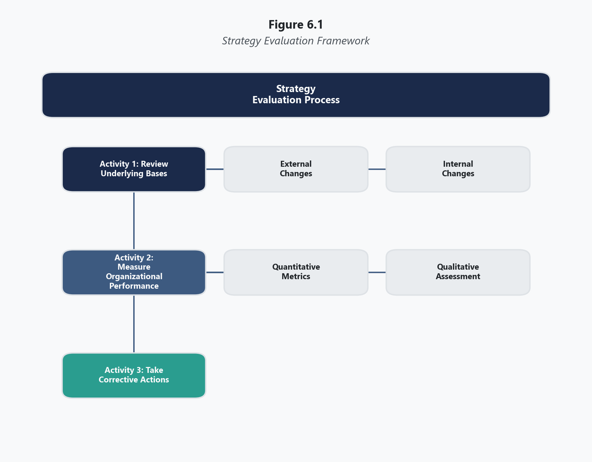
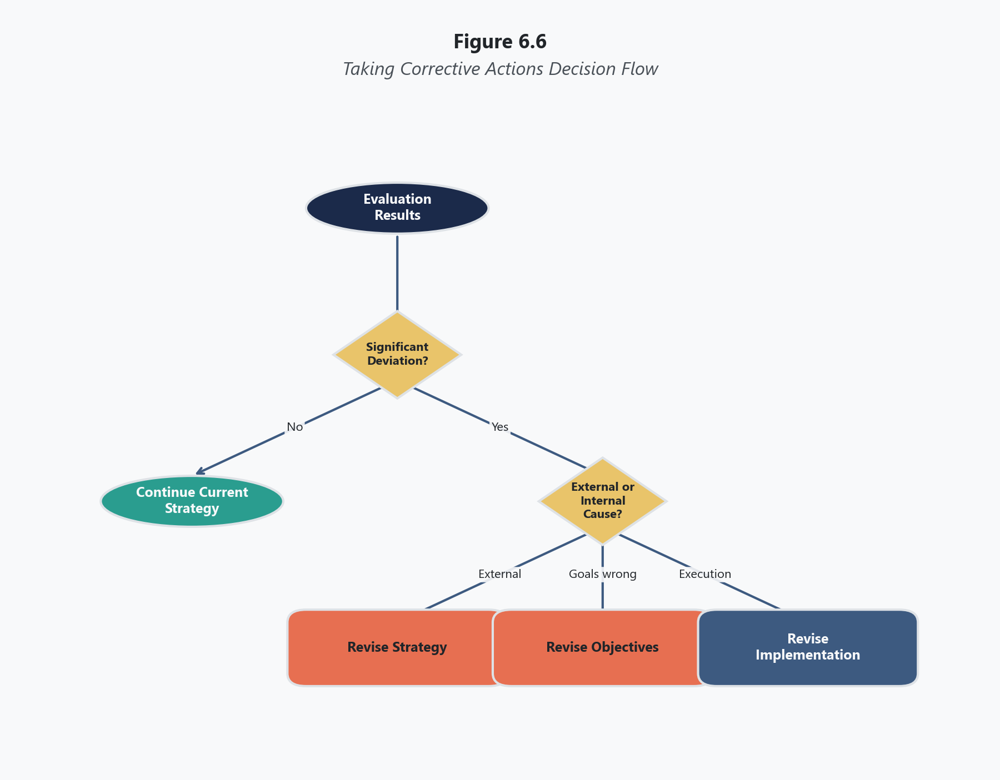
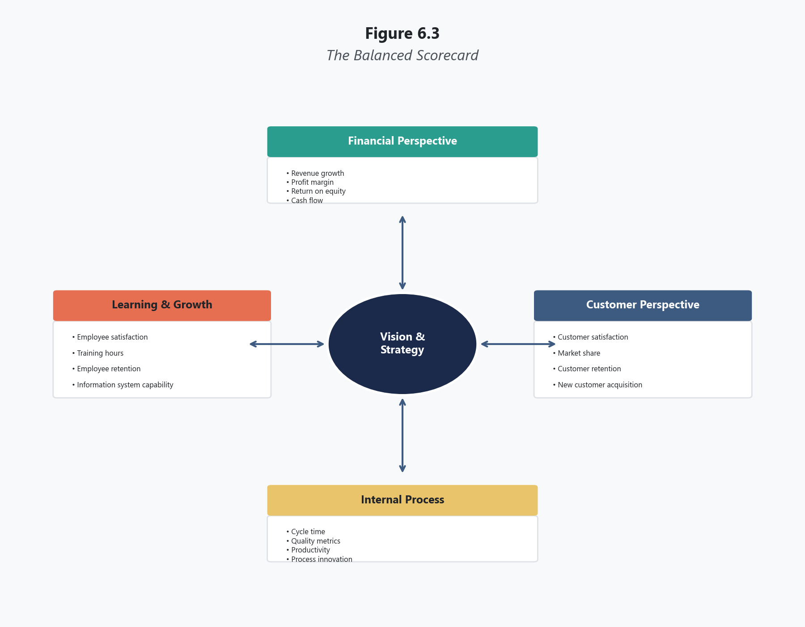
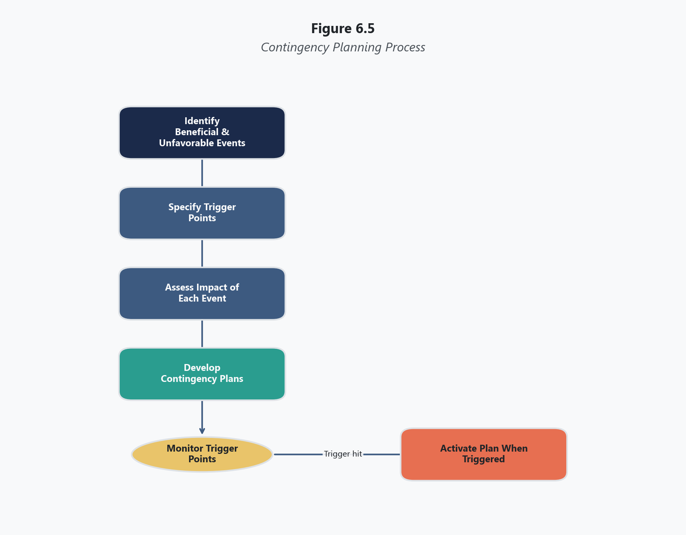
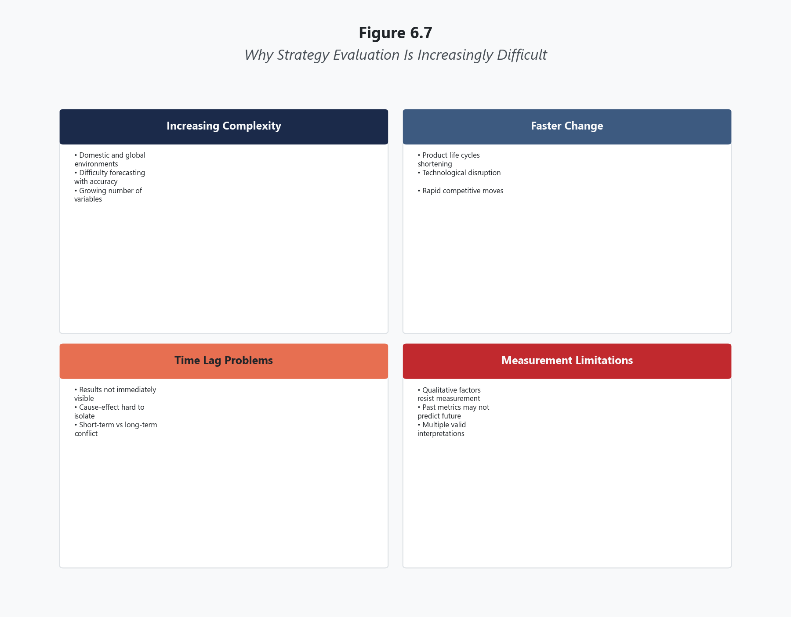
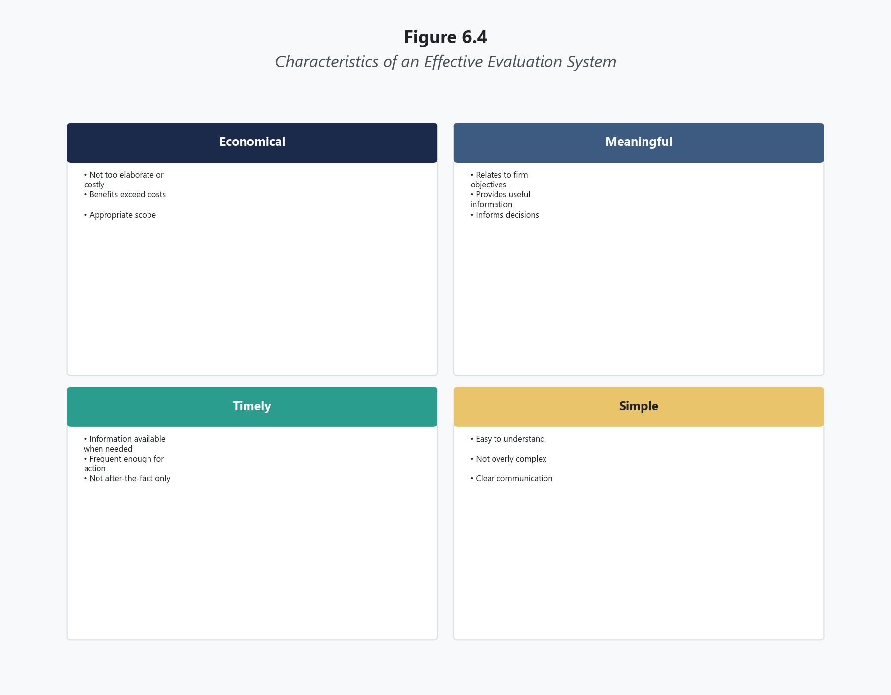

# Topic 6: Strategy Evaluation and Control

Essential Questions

- Why does strategy evaluation complete the strategic management process as a continuous loop rather than a terminal step, and what happens to organizations that treat formulation and implementation as sufficient without systematic feedback?
- How do the three evaluation activities — reviewing bases, measuring performance, and taking corrective action — function as an integrated diagnostic sequence, and why is the failure to act on findings the most common and most damaging evaluation breakdown?
- What distinguishes an evaluation system that relies on trailing financial indicators from one that uses the Balanced Scorecard's multiple perspectives, and why does that distinction determine whether strategic problems are detected early enough for effective correction?
- How do Rumelt's four criteria — consistency, consonance, feasibility, and advantage — provide a framework for testing strategic soundness before performance data confirms or denies success, and what makes consonance the most externally vulnerable of the four?

---

## Opening

A few years into my career, I served on a task force evaluating why a division's three-year growth strategy had quietly failed. The strategy had been well-formulated. The implementation plan had been resourced and launched on schedule. But somewhere between the launch and the present, the market had shifted, two key competitors had merged, commodity prices had doubled, and the strategy's core assumptions had become irrelevant. Nobody had noticed because nobody was checking.

The division had continued executing a strategy designed for a world that no longer existed. Eighteen months of effort and significant capital investment had been directed at objectives that no longer made strategic sense. When the task force delivered its findings, the reaction from senior leadership was not anger. It was embarrassment. The data that would have revealed the problem had been available for over a year. No one had been assigned to look at it.

This experience taught me something that no textbook had emphasized: strategy does not end with implementation. A strategy that is not continuously evaluated against changing conditions will eventually become irrelevant, and the organization will not realize it until the damage is done. Formulation without evaluation is guessing. Implementation without evaluation is hoping. Strategic management requires all three stages working together in a continuous loop.

This topic examines strategy evaluation and control — the third and final stage of the strategic management process. Where Topic 4 examined how to formulate and implement strategies, this topic examines how to determine whether those strategies are working, whether the assumptions underlying them remain valid, and what to do when they are not.

---

## Learning Objectives

By the end of this topic, you will be able to:

1. Describe the nature and importance of strategy evaluation as the final stage of strategic management
2. Explain the three fundamental evaluation activities: **reviewing bases**, measuring performance, and taking corrective actions
3. Describe Rumelt's (1980) four criteria for strategy evaluation: consistency, consonance, feasibility, and advantage
4. Construct and interpret a Balanced Scorecard using financial, customer, internal process, and learning/growth perspectives
5. Explain the role of contingency planning in strategy evaluation
6. Discuss how auditing supports the strategy evaluation process
7. Explain why strategy evaluation is increasingly difficult in rapidly changing environments
8. Describe the characteristics of an effective strategy-evaluation system

---

## The Nature and Importance of Strategy Evaluation

**Strategy evaluation** is the process of reviewing the bases of a strategy, measuring organizational performance against strategic objectives, and taking corrective actions when performance deviates from expectations. It is the final stage in the strategic management process, but calling it "final" is misleading. Strategy evaluation feeds directly back into strategy formulation, creating a continuous loop rather than a linear sequence. Every evaluation cycle generates information that may require revising the strategy, adjusting implementation, or in some cases, starting the formulation process over entirely.

The importance of strategy evaluation rests on a simple reality: the conditions that made a strategy appropriate at the time of its formulation will change (David & David, 2020). External factors shift. Competitors respond. Technologies evolve. Customer preferences migrate. Internal capabilities strengthen in some areas and weaken in others. A strategy that was optimal when it was chosen may become suboptimal — or outright dangerous — as conditions change. Without systematic evaluation, the organization has no mechanism for detecting these shifts until their consequences become unmistakable, by which point the cost of correction has multiplied.

Strategy evaluation also matters because success is deceptive. An organization that is performing well may assume its strategy is sound when, in fact, current performance is masking emerging problems. Strong revenue growth can hide deteriorating customer satisfaction. Healthy profit margins can mask declining market share. Short-term financial performance can obscure long-term competitive erosion. Evaluation disciplines the organization to look beyond current results and examine whether the foundations of its strategy remain intact.

The relationship between evaluation and the other stages of strategic management is reciprocal. Evaluation depends on the clarity of the objectives established during formulation — vague objectives cannot be evaluated because there is no standard against which to measure performance. Evaluation depends on the quality of implementation — poor implementation may cause strategy failure even when the strategy itself is sound, and evaluation must distinguish between a bad strategy and bad execution of a good strategy. And evaluation feeds forward into future formulation by identifying what has changed, what has worked, what has not, and what the organization should do differently.

---

## The Three Fundamental Evaluation Activities

Strategy evaluation consists of three sequential activities, each essential and each building on the previous one. Skipping any of the three renders the evaluation incomplete and potentially misleading.

**Figure 6.1**
*Strategy Evaluation Framework*

### Reviewing the Bases of Strategy

The first evaluation activity involves re-examining the external and internal factors that formed the foundation for the current strategy. This means returning to the EFE Matrix, the IFE Matrix, and the CPM — the input-stage tools from Topic 4 — and asking whether the factors, weights, and ratings have changed significantly since the strategy was formulated.

Reviewing external bases asks: Have the opportunities we identified materialized as expected? Have the threats we anticipated changed in magnitude or character? Have new opportunities or threats emerged that were not present during formulation? Has the competitive landscape shifted through mergers, new entrants, exits, or strategic repositioning by rivals? Have regulatory, technological, economic, or social conditions changed in ways that affect our strategy's assumptions?

Reviewing internal bases asks: Have our strengths been maintained, enhanced, or eroded? Have we addressed the weaknesses we identified, or have they worsened? Have new internal capabilities emerged that could be leveraged? Have key personnel departed? Has our financial position changed? Has our organizational culture shifted in ways that support or undermine the strategy?

The review of bases is not a casual exercise. It requires the same rigor that went into the original analysis. Updated EFE and IFE matrices should be constructed and compared against the originals. Significant changes in factor ratings or weights signal that the strategic foundation has shifted and the strategy may need revision.

The critical judgment in this activity is determining what constitutes a "significant" change. Not every environmental fluctuation requires strategic revision. Markets shift constantly, and an organization that revises its strategy in response to every change will lack strategic coherence. The question is whether the changes are substantial enough to invalidate the assumptions on which the strategy rests. A minor change in a competitor's pricing is noise. A major competitor merging with a technology firm that enables a fundamentally different business model is a signal that demands strategic reassessment.

### Measuring Performance

The second evaluation activity involves comparing actual organizational performance against the objectives established during strategy formulation. This is where the specificity of long-term and annual objectives — emphasized in Topic 4 — becomes operationally critical. Objectives that were stated in vague, unmeasurable terms cannot be evaluated. Objectives that were stated in specific, quantitative, time-bound terms can be evaluated precisely.

Performance measurement involves both **quantitative criteria** and **qualitative criteria**, and both are necessary for a complete evaluation.

**Quantitative criteria** include financial ratios (return on assets, return on equity, profit margins, earnings per share), revenue growth, market share, sales volume, cost metrics, and other numerical indicators. These metrics are essential because they provide objective, comparable data. However, they are also backward-looking — financial ratios tell you what has already happened, not what is about to happen. An organization that evaluates strategy solely through financial metrics will detect problems only after they have produced financial consequences, which may be months or years after the underlying strategic problem began.

**Qualitative criteria** include employee morale, customer satisfaction, product quality, innovation rates, brand perception, organizational learning, and strategic positioning. These metrics are harder to measure but often provide earlier warning signals than financial data. Declining customer satisfaction will eventually produce declining revenue, but the satisfaction decline may be detectable months before revenue declines. Rising employee turnover will eventually impair operational capability, but turnover trends are visible before capability erosion becomes measurable.

**Key Performance Indicators (KPIs)** are the specific, quantifiable measures that an organization selects to track strategic progress. Effective KPIs are directly linked to strategic objectives, measurable with available data, actionable (meaning the organization can influence them), and timely (meaning they are reported frequently enough to enable course correction). The selection of KPIs is itself a strategic decision. Organizations that track the wrong KPIs will optimize for the wrong outcomes. A retailer that tracks same-store sales growth but not customer acquisition cost may grow revenue while destroying profitability.

**Benchmarking** — comparing the organization's performance metrics against industry leaders, best practices, or historical performance — provides context for interpreting KPIs. A 5% return on assets means different things depending on whether the industry average is 3% or 12%. Benchmarking transforms raw performance data into strategic intelligence by answering the question: are we performing well relative to what is achievable?

### Taking Corrective Actions

The third evaluation activity — and the one most frequently neglected — involves taking action when the review of bases or performance measurement reveals problems. Identifying that a strategy is underperforming is analytically interesting. Doing something about it is strategically essential.

**Figure 6.6**
*Taking Corrective Actions Decision Flow*

**Corrective actions** can range from minor adjustments to fundamental strategic revision, depending on the nature and severity of the problem identified.

At the most incremental level, corrective actions may involve adjusting annual objectives, revising policies, reallocating resources within existing divisions, modifying compensation structures, or replacing underperforming personnel. These actions address implementation problems while preserving the underlying strategy.

At an intermediate level, corrective actions may involve revising the strategy itself — modifying the scope of market development, adjusting pricing strategy, accelerating or decelerating growth plans, or shifting resource allocation across business units. These actions acknowledge that the strategy needs modification but do not require starting the formulation process from the beginning.

At the most fundamental level, corrective actions may require completely revising the organization's strategic direction — abandoning a diversification strategy, divesting major business units, restructuring the organization, or fundamentally repositioning the company within its industry. These actions effectively restart the strategic management process from formulation.

The key diagnostic question in taking corrective action is: where does the problem originate? A performance shortfall could result from a flawed strategy (the wrong direction was chosen), flawed implementation (the right direction was chosen but executed poorly), flawed objectives (the targets were unrealistic given the strategy and resources), or changed conditions (the strategy was appropriate when formulated but conditions have shifted). Each diagnosis leads to a different corrective response. Revising a strategy that is sound but poorly implemented wastes the analytical work that produced a good strategy. Doubling down on implementation of a strategy whose foundations have eroded accelerates failure. Accurate diagnosis is the prerequisite for effective correction.

The corrective action stage is where many organizations fail. Identifying problems is intellectually satisfying. Diagnosing causes is analytically challenging. But taking action requires organizational courage — the willingness to admit that a strategy is failing, to reallocate resources away from invested positions, to change course when the current direction feels familiar and comfortable. Organizations that are skilled at evaluation but reluctant to act on their findings gain nothing from the exercise.

---

## Rumelt's Four Criteria for Strategy Evaluation

Richard Rumelt proposed four criteria for evaluating whether a strategy is sound. These criteria provide a framework for testing a strategy's logical coherence before performance data is available, making them useful both during formulation (as a quality check) and during evaluation (as a diagnostic tool).

**Figure 6.2**
*Rumelt's Four Criteria for Strategy Evaluation*

### Consistency

The **consistency** criterion asks whether the strategy presents mutually inconsistent goals or policies. A strategy is inconsistent when it simultaneously pursues objectives that conflict with each other or when its policies contradict its stated goals.

Inconsistency often emerges when strategies are assembled from multiple stakeholder inputs without adequate integration. One division's growth objectives may require resources that another division's growth objectives also require. A corporate policy of decentralized decision-making may conflict with a strategy requiring tight coordination across business units. A stated commitment to innovation may conflict with compensation systems that reward short-term cost reduction.

Organizational conflict that is persistent, systemic, and unresolved often signals strategic inconsistency. When departments consistently work at cross purposes, the problem may not be interpersonal conflict but strategic contradiction. The consistency criterion forces strategists to examine whether the strategy is internally coherent or whether it contains contradictions that will undermine implementation.

### Consonance

The **consonance** criterion asks whether the strategy is an adaptive response to the external environment and the changes occurring within it. A consonant strategy matches the organization's approach to the realities of its competitive, technological, economic, and social environment.

**Consonance** is the most externally focused of **Rumelt's criteria**. A strategy that was consonant when it was formulated can become dissonant as the environment changes. A brick-and-mortar retail strategy was consonant with the environment of the 1990s but increasingly dissonant as e-commerce transformed consumer behavior in the 2000s and 2010s. Evaluating consonance requires ongoing environmental scanning and honest comparison of the strategy's assumptions against current conditions.

The consonance criterion is particularly challenging because environmental change is often gradual. Organizations adapt to incremental shifts without recognizing that the cumulative effect has fundamentally altered the strategic landscape. By the time the dissonance becomes obvious, the organization may have spent years executing a strategy that was slowly becoming irrelevant.

### Feasibility

The **feasibility** criterion asks whether the strategy can be accomplished with the available physical, human, and financial resources. A strategy that overtaxes the organization's resources is infeasible regardless of how attractive the strategic direction may be.

**Feasibility** assessment must be realistic, not aspirational. Organizations frequently adopt strategies that assume resources will materialize through the strategy's own success — "we'll fund the expansion from the profits the expansion generates." While some degree of strategic leverage is appropriate, strategies that depend entirely on future success to fund current commitments are built on circular logic. The feasibility criterion forces an honest accounting of what resources are actually available and whether they are sufficient for the strategy's requirements.

Feasibility also includes organizational capability. An organization may have the financial resources to pursue a strategy but lack the managerial talent, technological infrastructure, or organizational systems required for successful execution. A company with ample cash but no experience in international markets may have the financial feasibility but not the operational feasibility to pursue international expansion.

### Advantage

The **advantage** criterion asks whether the strategy creates or maintains competitive advantage in the chosen area of activity. A strategy that fails the advantage test may be internally consistent, environmentally consonant, and resource-feasible but still strategically inadequate because it does not produce a distinctive competitive position.

Competitive advantage, as examined in Topic 3 through the VRIO framework, arises from resources and capabilities that are valuable, rare, costly to imitate, and organized for exploitation. The advantage criterion asks whether the strategy leverages such resources or, alternatively, whether it positions the organization to develop them. A strategy that does neither will produce competitive parity at best and competitive disadvantage at worst.

The advantage criterion connects strategy evaluation back to the Resource-Based View. During evaluation, the organization should ask: does our strategy continue to exploit our distinctive competencies? Have competitors imitated or substituted our sources of advantage? Are we building new sources of advantage to replace those that are eroding? If the answers indicate that competitive advantage is declining, corrective action is required even if current financial performance remains acceptable, because financial results lag competitive position.

---

## The Balanced Scorecard

The **Balanced Scorecard**, developed by Robert Kaplan and David Norton (Kaplan & Norton, 1992, 1996), addresses a fundamental limitation of traditional strategy evaluation: the overreliance on financial metrics. Financial measures are necessary but insufficient. They tell you whether the organization has performed well financially, but they do not explain why, and they do not provide early warning of future performance problems. The Balanced Scorecard supplements financial evaluation with three additional perspectives that together provide a more complete picture of strategic health.

**Figure 6.3**
*The Balanced Scorecard*

### The Financial Perspective

The financial perspective asks: "How do we look to shareholders?" This perspective includes traditional financial metrics such as revenue growth, profitability, return on investment, cash flow, and economic value added. Financial metrics remain essential because they represent the ultimate outcome that most strategies seek to improve. However, they are trailing indicators — by the time financial results deteriorate, the underlying problems may have been developing for months or years.

### The Customer Perspective

The customer perspective asks: "How do customers see us?" This perspective includes metrics such as customer satisfaction, customer retention, market share, customer acquisition cost, and net promoter score. Customer metrics are leading indicators of financial performance: declining customer satisfaction will eventually produce declining revenue, and improving customer loyalty will eventually improve profitability. Monitoring the customer perspective provides earlier warning of strategic problems and earlier confirmation of strategic success than financial metrics alone.

### The Internal Process Perspective

The internal process perspective asks: "What must we excel at?" This perspective identifies the critical internal processes that drive the outcomes measured in the financial and customer perspectives. Metrics may include cycle time, defect rates, production efficiency, innovation pipeline health, and process improvement rates. The internal process perspective forces the organization to identify the operational capabilities that are most critical to strategic success and to monitor them directly rather than inferring them from financial or customer data.

### The Learning and Growth Perspective

The learning and growth perspective asks: "Can we continue to improve and create value?" This perspective examines the organization's capacity for adaptation, innovation, and development. Metrics may include employee satisfaction, employee training hours, employee turnover, information system capabilities, organizational knowledge creation, and leadership development pipeline health. The learning and growth perspective is the most forward-looking of the four perspectives because it evaluates whether the organization is building the capabilities it will need for future strategic success, not just executing its current strategy effectively.

### Integrating the Four Perspectives

The Balanced Scorecard's power lies in the integration of all four perspectives into a coherent evaluation system. The perspectives are connected by cause-and-effect relationships. Learning and growth capabilities enable excellent internal processes. Excellent internal processes drive customer satisfaction and loyalty. Customer satisfaction drives financial performance. Evaluating all four perspectives simultaneously allows the organization to identify where in this causal chain problems are developing or improvements are occurring.

Each perspective should include specific objectives (what the organization wants to achieve), measures (how achievement will be tracked), targets (what level of performance is expected), and initiatives (what actions will be taken to reach the targets). A Balanced Scorecard with vague objectives and missing targets is merely a concept. A Balanced Scorecard with specific, measurable, time-bound objectives and concrete initiatives is a management tool.

---

## Contingency Planning

**Contingency planning** involves developing alternative strategies that can be implemented if key events do not occur as expected. Contingency plans are not alternative strategies chosen through the QSPM — they are pre-developed response plans for specific scenarios that would invalidate the current strategy.

**Figure 6.5**
*Contingency Planning Process*

Effective contingency planning begins with identifying the key assumptions and trigger events upon which the current strategy depends. If the strategy assumes moderate economic growth, what happens if a recession occurs? If the strategy assumes a key competitor will not enter the market, what happens if they do? If the strategy assumes regulatory stability, what happens if new regulations are enacted?

For each trigger event, three scenarios should be developed: **best case** (the trigger event occurs in the most favorable possible way), **worst case** (the trigger event occurs in the most unfavorable possible way), and most likely case (the most probable outcome based on available information). For each scenario, a pre-planned response should be developed so that the organization can respond quickly rather than beginning the planning process from scratch when the event occurs.

Contingency planning provides several benefits beyond the obvious one of preparedness. The process of identifying trigger events forces strategists to make their assumptions explicit, which often reveals assumptions that were never examined. The process of developing alternative responses builds organizational flexibility and reduces the cognitive lock-in that comes from committing entirely to a single strategic direction. And the existence of contingency plans reduces organizational anxiety about uncertainty, because leaders know that responses have been thought through even if the triggering event has not occurred.

The most effective contingency plans are specific, actionable, and rehearsed. A contingency plan that says "if the economy enters recession, we will reduce costs" is too vague to be useful. A contingency plan that specifies exactly which costs will be reduced, by how much, in what sequence, with what impact on which operations, and triggered by what specific economic indicators is a plan that can actually be executed under pressure.

---

## Auditing and Strategy Evaluation

A **strategic audit** is a comprehensive examination of the entire strategic management process — from environmental scanning through strategy formulation, implementation, and evaluation. The strategic audit provides a systematic, periodic review of the organization's strategic management practices, identifying areas where the process is working well and areas where it needs improvement.

Auditing supports strategy evaluation in several ways. External audits by independent parties provide objectivity that internal evaluation may lack. Organizations develop blind spots about their own performance and processes, and external auditors can identify problems that insiders have normalized or failed to see. Financial audits verify that the quantitative data used for performance measurement is accurate and reliable. Operational audits examine whether internal processes are functioning as intended. Strategic audits evaluate whether the strategic management process itself is sound.

The relationship between auditing and evaluation is complementary. Evaluation asks: "Is our strategy working?" Auditing asks: "Is our evaluation process working?" An organization that evaluates its strategy using inaccurate data, biased assessments, or incomplete analysis will reach incorrect conclusions regardless of how diligently it evaluates. Auditing provides quality assurance for the evaluation process itself.

---

## Why Strategy Evaluation Is Increasingly Difficult

The pace and complexity of environmental change make strategy evaluation more difficult and more important than at any previous time. Several factors contribute to this increasing difficulty.

**Figure 6.7**
*Why Strategy Evaluation Is Increasingly Difficult*

Accelerating environmental change means that the assumptions underlying a strategy may become invalid more quickly than in the past. Product life cycles are shorter. Technological disruption is faster (Christensen, 1997). Consumer preferences shift more rapidly through social media amplification. Competitive responses are quicker because information travels instantly. The window between strategy formulation and strategy obsolescence is narrowing.

**Increasing complexity** means that more variables interact in more ways, making causal relationships harder to identify. When financial performance declines, is the cause internal (operational problems), external (market shifts), competitive (rival actions), regulatory (new compliance costs), or some combination of all four? Isolating causes in a complex system is fundamentally more difficult than in a simple one.

**Information overload** paradoxically makes evaluation harder despite providing more data. Organizations today have access to more performance data than at any point in history, but the volume of data can obscure rather than illuminate. The challenge is no longer collecting data but identifying which data is strategically relevant, which signals deserve attention, and which represent noise that should be filtered out.

**Organizational inertia** resists the conclusions of strategy evaluation. Even when evaluation clearly indicates that a strategy is failing, organizations resist changing course because of sunk cost psychology (we have invested too much to change now), identity attachment (this strategy defines who we are), political dynamics (changing strategy would shift power between divisions), and simple cognitive bias (we see what we want to see in the data).

These difficulties do not reduce the importance of strategy evaluation. They increase it. An organization operating in a rapidly changing environment without systematic evaluation is navigating without instruments. The fact that evaluation is difficult makes it more important, not less.

---

## Characteristics of an Effective Evaluation System

An effective strategy-evaluation system exhibits several essential characteristics that distinguish rigorous evaluation from bureaucratic reporting.

**Figure 6.4**
*Characteristics of an Effective Evaluation System*

**Economical.** Evaluation should provide the information needed for strategic decision-making without consuming excessive resources. Elaborate evaluation systems that cost more to operate than the decisions they inform are counterproductive. The level of evaluation activity should be proportional to the stakes involved and the rate of environmental change.

**Meaningful.** The metrics and criteria used for evaluation should be directly related to strategic objectives. Metrics that are easy to measure but strategically irrelevant provide false comfort. Metrics that are difficult to measure but strategically critical should not be abandoned simply because they require more effort. The evaluation system should measure what matters, not what is convenient.

**Timely.** Evaluation information must be available when decisions need to be made. Annual strategy reviews are insufficient in rapidly changing environments. Quarterly or monthly evaluation of key indicators provides more actionable intelligence. Real-time monitoring of critical metrics is appropriate for fast-moving competitive situations. The frequency of evaluation should match the pace of change in the organization's environment.

Provide a true picture. Evaluation must be honest, which means it must include bad news as well as good news, acknowledge uncertainty rather than manufacturing false precision, and resist the organizational tendency to present results in the most favorable light. An evaluation system that consistently reports positive results while competitive position deteriorates is worse than no evaluation system because it creates false confidence.

Foster mutual trust. Evaluation should be perceived as a constructive process that helps the organization improve, not as a punitive process that assigns blame. When managers fear that honest evaluation results will be used against them, they will manage the evaluation rather than manage the strategy. Effective evaluation systems create psychological safety for honest reporting and focus attention on learning and improvement rather than reward and punishment.

**Facilitate action.** The purpose of evaluation is not to generate reports but to inform decisions and stimulate action. An evaluation system that produces beautifully formatted dashboards that no one reads or acts upon has failed. Evaluation should be directly connected to decision-making processes, corrective action mechanisms, and resource allocation decisions. Every evaluation should conclude with a clear answer to the question: based on what we have learned, what should we do now?

Not dominate decisions. While evaluation informs strategic decisions, it should not replace strategic judgment. Metrics provide data, but data requires interpretation. A single quarter of declining sales does not necessarily require strategic revision. A pattern of declining customer satisfaction across multiple segments probably does. The evaluation system should inform management judgment, not substitute for it.

---

## Application: Netflix's Continuous Strategy Evaluation

Netflix provides a compelling example of an organization that has used strategy evaluation effectively to navigate multiple strategic transitions over its history.

Netflix began as a DVD-by-mail service competing against Blockbuster's brick-and-mortar rental model. An ongoing review of external bases would have revealed the growing availability of broadband internet, the increasing digitization of media content, and the changing consumer expectation for on-demand access. These environmental changes did not invalidate the DVD-by-mail strategy overnight, but they progressively eroded the foundations upon which that strategy rested.

Netflix's evaluation system detected these shifts and prompted corrective action: the transition from DVD-by-mail to streaming delivery. This transition was not a single decision but a series of evaluated moves. Netflix launched streaming as a supplement to DVD service, measured adoption rates and customer behavior, evaluated the impact on subscriber growth and retention, and progressively shifted resources from physical distribution to streaming infrastructure. Each step was evaluated against strategic objectives, and each evaluation informed the next step.

The company's subsequent transition into original content production followed a similar pattern of continuous evaluation. As licensing costs for third-party content escalated and competitors launched their own streaming services, Netflix's evaluation of its competitive position revealed that relying on licensed content was strategically unsustainable. The corrective action — investing billions in original programming — was driven by strategic evaluation, not by a sudden insight.

Netflix's evaluation has not been flawless. The 2011 decision to split DVD and streaming services into separate brands (Qwikster) was a corrective action that customers rejected violently. Netflix's evaluation system detected the customer backlash quickly, and the company reversed the decision within weeks. The speed of that reversal — recognizing the error and correcting it before permanent damage occurred — itself demonstrates effective evaluation discipline. The willingness to reverse a CEO's public decision is uncommon and requires the kind of organizational honesty that effective evaluation demands.

More recently, Netflix's evaluation of subscriber growth plateaus in mature markets led to corrective actions including the introduction of an advertising-supported tier and crackdowns on password sharing — strategic adjustments driven by evaluation data indicating that the previous growth model had reached its limits.

---

## Application: Kodak's Evaluation Failure

If Netflix demonstrates effective strategy evaluation, Kodak demonstrates the catastrophic consequences of evaluation failure.

Kodak invented digital photography technology in 1975. The company had the internal capabilities, the market knowledge, and the financial resources to lead the digital transition. A Balanced Scorecard analysis would have revealed troubling signals across multiple perspectives. The customer perspective would have shown increasing consumer interest in digital imaging. The internal process perspective would have shown that Kodak's manufacturing processes were optimized entirely for film production. The learning and growth perspective would have shown that the organization's capabilities and culture were built around chemical photography, not digital technology. Only the financial perspective — where film remained enormously profitable — provided reassuring data.

The problem was that Kodak's evaluation system was dominated by the financial perspective. As long as film was profitable, the evaluation concluded that the strategy was sound. The leading indicators available in the customer, internal process, and learning/growth perspectives were either not measured or not acted upon. The organization reviewed its bases selectively, measured performance through the most favorable lens, and declined to take corrective action because current financial results did not demand it.

By the time financial results deteriorated to the point where corrective action was unavoidable, the competitive landscape had shifted so fundamentally that corrective action was insufficient. Kodak filed for bankruptcy in 2012. The company that invented digital photography was destroyed by digital photography because its evaluation system failed to look beyond current profitability to the strategic reality underneath.

Kodak's failure validates every principle in this topic. Evaluation must examine all four Balanced Scorecard perspectives, not just financial results. Reviewing the bases of strategy must be honest, even when the findings are uncomfortable. Corrective action must be taken proactively, before financial decline forces reactive decisions. And evaluation must be timely — detecting a strategic threat five years after it could have been addressed is not evaluation. It is autopsy.

---

## Ethical Considerations and the Discipline of Honest Evaluation

Strategy evaluation places a particular ethical demand on leaders: the obligation to be honest about what the data reveals, even when honesty is uncomfortable, politically costly, or personally threatening.

Galatians 6:9 (NIV) instructs: "Let us not become weary in doing good, for at the proper time we will reap a harvest if we do not give up." This passage speaks to the perseverance required in evaluation. Strategy evaluation is not a one-time event. It is an ongoing discipline that requires consistent attention, repeated measurement, and continuous willingness to act on what is discovered. The temptation to abandon rigorous evaluation when short-term results look favorable — to declare victory and move on — must be resisted. The harvest comes from sustained faithfulness to the process, not from periodic bursts of attention.

James 1:22-25 (NIV) adds a sharper edge:

> Do not merely listen to the word, and so deceive yourselves. Do what it says.
> Anyone who listens to the word but does not do what it says is like someone
> who looks at his face in a mirror and, after looking at himself, goes away and
> immediately forgets what he looks like.

Applied to strategy evaluation, this passage confronts the most common evaluation failure: identifying problems and then failing to act on them. An organization that conducts thorough evaluation and produces detailed reports but never takes corrective action has merely looked in the mirror and walked away. The evaluation has informed no one and changed nothing.

The ethical dimension of strategy evaluation extends beyond honesty to stewardship. When leaders evaluate strategy honestly and act on their findings, they are being faithful stewards of the resources, people, and mission entrusted to their care. When they allow biased evaluation to mask strategic problems, they are squandering that trust. The Balanced Scorecard, Rumelt's criteria, contingency planning, and the three evaluation activities are not merely analytical tools. They are mechanisms for organizational accountability. They exist so that leaders cannot claim ignorance of problems that disciplined evaluation would have revealed.

---

## Conclusion

Strategy evaluation completes the strategic management process by providing the feedback mechanism that connects strategic outcomes back to strategic planning. Without evaluation, strategy formulation is a one-time guess. Without evaluation, implementation operates without course correction. Without evaluation, organizations discover strategic failure only when it manifests in financial crisis, which is the most expensive and least reversible point of discovery.

The three evaluation activities — reviewing bases, measuring performance, and taking corrective action — provide the operational framework. Rumelt's four criteria — consistency, consonance, feasibility, and advantage — provide the diagnostic framework. The Balanced Scorecard provides the measurement framework, ensuring that evaluation extends beyond financial metrics to encompass customer, process, and organizational learning perspectives. Contingency planning prepares the organization for environmental shifts that evaluation may detect. And the characteristics of effective evaluation systems ensure that the process produces honest, timely, actionable information rather than bureaucratic reporting.

The strategic management process is circular, not linear. Formulation leads to implementation, which leads to evaluation, which feeds back into formulation. Organizations that master all three stages and maintain their continuous integration do not merely survive. They adapt, learn, and build competitive advantage that endures through changing conditions. Organizations that neglect evaluation — whether through overconfidence, complacency, political avoidance, or simple inattention — leave themselves vulnerable to the one threat that no strategy can survive: the failure to recognize when the world has changed.

---

## Key Terms

**Balanced Scorecard** — A strategy evaluation tool developed by Kaplan and Norton that measures organizational performance across four perspectives: financial, customer, internal process, and learning and growth

**Benchmarking** — The practice of comparing an organization's performance metrics against industry leaders, best practices, or historical performance to provide evaluative context

**Consonance** — Rumelt's criterion requiring that a strategy be an adaptive response to the external environment and the changes occurring within it

**Consistency** — Rumelt's criterion requiring that a strategy not present mutually inconsistent goals and policies

**Contingency Plan** — A pre-developed alternative plan activated when specified trigger events occur that invalidate the current strategy

**Corrective Actions** — Changes to strategies, objectives, policies, structure, or personnel implemented when strategy evaluation reveals performance deviation or changed conditions

**Feasibility** — Rumelt's criterion requiring that a strategy not overtax available physical, human, and financial resources

**Key Performance Indicators (KPIs)** — Specific, quantifiable measures selected to track strategic progress and evaluate performance against objectives

**Advantage** — Rumelt's criterion requiring that a strategy create or maintain competitive advantage in the chosen area of activity

**Reviewing Bases** — The first evaluation activity, involving re-examination of the external and internal factors that formed the foundation for the current strategy

**Rumelt's Criteria** — Four tests for evaluating strategy soundness: consistency, consonance, feasibility, and advantage

**Strategic Audit** — A comprehensive examination of the entire strategic management process, from environmental scanning through formulation, implementation, and evaluation

**Strategy Evaluation** — The process of reviewing the bases of strategy, measuring organizational performance against objectives, and taking corrective actions when necessary

---

## Knowledge Check

### Multiple Choice

**Question 1 [Bloom's: Analyze]**

A manufacturing company's Balanced Scorecard reveals the following: financial metrics are strong (ROE above industry average, revenue growing 8%), customer satisfaction scores have declined for three consecutive quarters, internal process metrics show increasing defect rates, and employee turnover has risen 15% year-over-year. What does this pattern most likely indicate?

A) The strategy is performing well because the most important metrics — financial results — are strong
B) Leading indicators (customer satisfaction, process quality, employee retention) suggest future financial deterioration that current financial results have not yet reflected
C) The company should invest in employee retention programs but otherwise maintain its current strategy
D) The Balanced Scorecard is producing contradictory results, indicating the metrics need to be recalibrated

*Correct Answer: B*
*Rationale: The Balanced Scorecard's four perspectives are connected by cause-and-effect relationships. Declining employee satisfaction and rising turnover (learning/growth) erode internal process quality (increasing defects), which will eventually reduce customer satisfaction (already declining), which will ultimately impair financial results (currently strong but lagging). The strong financial metrics are trailing indicators reflecting past performance. The declining leading indicators signal that future financial performance is at risk. Answer A focuses only on trailing indicators. Answer C treats the symptoms (employee retention) without recognizing the systemic pattern. Answer D misinterprets purposeful diagnostic tension as calibration error.*

**Question 2 [Bloom's: Analyze]**

An organization evaluates its current strategy using Rumelt's four criteria and finds the following: the strategy's goals and policies do not conflict with each other (consistent), the strategy can be executed with available resources (feasible), and the strategy creates competitive advantage through unique capabilities (advantage). However, the external environment has shifted significantly since the strategy was formulated — a major new competitor has entered the market and consumer preferences have changed. Which criterion does the strategy fail, and what is the implication?

A) The strategy fails the feasibility criterion because new competitive pressures will require additional resources
B) The strategy fails the consonance criterion because it is no longer an adaptive response to the current external environment, suggesting strategic revision is needed
C) The strategy fails the consistency criterion because external changes create internal conflicts
D) The strategy fails the advantage criterion because the new competitor may erode competitive advantage

*Correct Answer: B*
*Rationale: Consonance specifically requires that the strategy be an adaptive response to the external environment. When the environment shifts significantly (new competitor, changed consumer preferences), a strategy that was consonant when formulated may no longer match current conditions, even if it remains internally consistent, resource-feasible, and advantage-generating. The implication is that the strategy needs revision to realign with the changed environment. Answer A conflates environmental change with resource sufficiency. Answer C confuses internal consistency with external alignment. Answer D addresses a possible future consequence rather than the criterion the strategy currently fails.*

**Question 3 [Bloom's: Analyze]**

A retail chain's annual strategy review reveals that its market development strategy (expanding into the Southwest region) has underperformed expectations. Revenue in the new region is 40% below target, while revenue in existing regions exceeds targets by 12%. Which diagnostic question is most critical for determining the appropriate corrective action?

A) Should the company abandon all market development strategies and focus on existing markets?
B) Is the underperformance caused by a flawed strategy (the Southwest is not a viable market), flawed implementation (the execution was inadequate), flawed objectives (the targets were unrealistic), or changed conditions (the market has shifted since formulation)?
C) Should the company replace the regional manager responsible for the Southwest expansion?
D) Should the company increase marketing spending in the Southwest to reach the revenue target?

*Correct Answer: B*
*Rationale: The corrective action framework requires diagnosing where the problem originates before determining what to do about it. The underperformance could stem from multiple sources, and each diagnosis leads to a different corrective response. If the strategy is flawed, the company should exit the Southwest. If implementation is flawed, the company should improve execution. If objectives were unrealistic, the company should revise targets. If conditions have changed, the company should reassess the opportunity. Answers A, C, and D each prescribe a specific corrective action without first diagnosing the cause, which could lead to the wrong correction.*

**Question 4 [Bloom's: Analyze]**

A company develops a contingency plan for the scenario: "Major competitor acquires a key technology firm, gaining AI capabilities we lack." The contingency plan states: "If this occurs, we will respond appropriately to maintain our competitive position." What is the fundamental weakness of this contingency plan?

A) The trigger event is too unlikely to justify contingency planning
B) The plan is too vague to be actionable — it specifies neither the specific response, the resources required, the timeline for action, nor the metrics for evaluating the response's effectiveness
C) Contingency plans should only address internal risks, not competitive actions
D) The plan should focus on preventing the acquisition rather than responding to it

*Correct Answer: B*
*Rationale: Effective contingency plans must be specific, actionable, and executable under pressure. A plan that says "respond appropriately" provides no guidance when the trigger event actually occurs. The plan should specify exactly what actions will be taken (accelerate internal AI development, acquire an alternative technology firm, form a strategic partnership), what resources will be required, who is responsible, what the timeline is, and how success will be measured. Answer A dismisses a plausible competitive scenario. Answer C incorrectly limits the scope of contingency planning. Answer D confuses contingency planning with competitive strategy.*

**Question 5 [Bloom's: Analyze]**

During strategy evaluation, a company discovers that its cost leadership strategy is achieving all financial targets. However, the review of external bases reveals that three competitors have adopted similar cost structures through automation and offshore manufacturing. Using Rumelt's criteria and the evaluation framework, what should the company conclude?

A) No action is needed because financial targets are being met
B) The strategy may still be consistent, consonant, and feasible, but it is failing the advantage criterion because the cost position is no longer rare, suggesting the need for strategic differentiation or finding new sources of cost advantage
C) The company should immediately abandon cost leadership and pursue a differentiation strategy
D) The company should reduce costs further to maintain its position as the lowest-cost producer

*Correct Answer: B*
*Rationale: When competitors achieve similar cost structures, the company's cost position is no longer rare (VRIO framework) and no longer provides competitive advantage (Rumelt's advantage criterion). Meeting financial targets today does not guarantee future competitive success — financial results are trailing indicators. The evaluation should prompt the company to consider whether it can find new sources of cost advantage that competitors cannot replicate, or whether strategic repositioning toward differentiation or focus is necessary. Answer A relies solely on trailing financial indicators. Answer C prescribes action without adequate analysis. Answer D assumes further cost reduction is possible and sufficient without evidence.*

**Question 6 [Bloom's: Analyze]**

An organization's strategy evaluation system is characterized by the following: evaluations occur annually, reports are reviewed only by the CEO and CFO, negative findings are routinely softened before presentation to the board, and no corrective actions have been taken in the past three evaluation cycles despite declining market share. Which characteristics of an effective evaluation system are being violated?

A) Only the "timely" characteristic is violated because annual evaluations are insufficient
B) Multiple characteristics are violated: timeliness (annual is too infrequent given declining market share), honesty/true picture (negative findings are softened), facilitation of action (no corrective actions taken), and breadth of participation (only CEO and CFO review)
C) The system is effective because the CEO and CFO are the appropriate decision-makers for strategic evaluation
D) The only problem is that corrective actions have not been taken; the evaluation process itself is adequate

*Correct Answer: B*
*Rationale: The system violates multiple characteristics of effective evaluation simultaneously. Annual evaluation is insufficient when market share is declining (timeliness). Softening negative findings before board presentation prevents the system from providing a "true picture." Three cycles without corrective action despite declining performance means the system fails to "facilitate action." And limiting review to two executives prevents the broader organizational engagement that evaluation requires. These failures are interconnected: an untimely system that softens bad news and excludes most leaders will predictably fail to produce corrective action. Answer A identifies only one violation. Answer C ignores the suppression of negative findings. Answer D ignores the systemic failures that prevent action.*

**Question 7 [Bloom's: Analyze]**

A technology company measures strategy performance using the following KPIs: quarterly revenue, annual profit, stock price, and earnings per share. The CEO argues that these metrics provide a comprehensive view of strategic health. Using the Balanced Scorecard framework, what is the most significant limitation of this evaluation approach?

A) The KPIs are too numerous and should be reduced to one or two key metrics
B) All four KPIs measure only the financial perspective, providing no insight into the customer, internal process, or learning and growth perspectives that drive future financial performance
C) Stock price is not a valid KPI because it is influenced by market factors beyond the company's control
D) The KPIs should include industry-specific metrics rather than general financial measures

*Correct Answer: B*
*Rationale: The Balanced Scorecard framework explicitly addresses the inadequacy of financial-only evaluation. Revenue, profit, stock price, and EPS are all financial metrics — trailing indicators that reflect past performance. This evaluation provides no insight into customer satisfaction or loyalty (which drives future revenue), internal process quality (which drives future cost and quality), or organizational learning and capability development (which drives future innovation and adaptation). The company is evaluating strategy through only one of four necessary lenses. Answer A incorrectly suggests fewer metrics. Answer C identifies a valid but secondary issue. Answer D addresses metric specificity rather than the fundamental perspective imbalance.*

**Question 8 [Bloom's: Analyze]**

A healthcare organization's strategy review reveals that its IFE total weighted score has decreased from 3.1 to 2.3 over two years while its EFE total weighted score has remained stable at 2.9. What does this change in the bases of strategy most likely indicate, and how should it influence strategic evaluation?

A) The decrease is statistically insignificant and should be ignored
B) Internal capabilities have deteriorated significantly while the external environment has remained relatively stable, suggesting that implementation problems or internal resource erosion are undermining the strategy and that corrective action should focus on strengthening internal capabilities
C) The organization should formulate a new strategy because the IFE score has crossed below the 2.5 midpoint
D) The stable EFE score confirms that the strategy remains sound despite the IFE decline

*Correct Answer: B*
*Rationale: A decrease from 3.1 to 2.3 in the IFE score represents a significant decline in internal capabilities (from well above the 2.5 midpoint to below it). Since the EFE score remained stable, the problem is internal rather than external — the organization's strengths are weakening or its weaknesses are growing. This pattern suggests implementation failures, resource erosion, talent loss, or operational decline. Corrective action should diagnose the specific internal factors that have changed and address them directly. Answer A dismisses a meaningful decline (0.8 points is substantial). Answer C jumps to complete reformulation when internal strengthening may be sufficient. Answer D incorrectly treats the EFE score as validation of the overall strategy.*

**Question 9 [Bloom's: Analyze]**

During a strategy evaluation meeting, the VP of Sales argues against revising the current growth strategy despite evidence of declining market share, noting that the company has invested $50 million in implementation over two years. "We cannot walk away from that investment," she argues. "We need to give the strategy more time." Which evaluation concept does this argument most directly violate?

A) The argument violates the Balanced Scorecard principle by focusing only on financial investment
B) The argument demonstrates the sunk cost fallacy, which conflicts with the corrective action principle that decisions should be based on current conditions and future prospects, not on past investments that cannot be recovered
C) The argument violates Rumelt's consistency criterion by presenting conflicting goals
D) The argument is valid because strategies require time to produce results and premature revision wastes resources

*Correct Answer: B*
*Rationale: The sunk cost fallacy — the tendency to continue a course of action because of past investment rather than future prospects — is one of the most common barriers to effective corrective action. The $50 million is already spent and cannot be recovered regardless of whether the strategy is continued or revised. The corrective action decision should be based on current evidence (declining market share) and future prospects (whether the strategy's foundations remain sound), not on the irrecoverable cost of past implementation. Answer A misidentifies the concept. Answer C misapplies Rumelt's criterion. Answer D accepts the sunk cost reasoning as valid, which contradicts evaluation principles.*

**Question 10 [Bloom's: Analyze]**

An organization conducts all three strategy evaluation activities with exemplary rigor: the bases of strategy are reviewed quarterly using updated EFE and IFE matrices, performance is measured monthly against detailed KPIs across all four Balanced Scorecard perspectives, and corrective actions are identified with specific recommendations. However, the corrective action recommendations are filed in reports that no executive reads, and no organizational changes are made. What principle of strategy evaluation does this failure illustrate?

A) The evaluation system is effective because all three activities are performed rigorously
B) The system demonstrates that evaluation without action is merely an intellectual exercise — the purpose of evaluation is to inform decisions and produce change, not to generate reports, regardless of how thorough the analysis
C) The failure is a leadership problem, not an evaluation system problem
D) The solution is to automate the corrective actions so they do not require executive review

*Correct Answer: B*
*Rationale: This scenario illustrates the principle that evaluation must "facilitate action" and that its purpose is to inform decisions, not to generate reports. A system that performs all three evaluation activities but produces no organizational response has failed at its fundamental purpose. The analysis is rigorous but functionally useless because it does not connect to decision-making processes or corrective action mechanisms. Answer A evaluates the process rather than the outcome — a system that produces no change cannot be called effective regardless of its analytical quality. Answer C is partially correct but frames it too narrowly — the evaluation system itself should be designed to connect analysis to action. Answer D oversimplifies the relationship between analysis and organizational action.*

### Critical Thinking

**Scenario 1**

You are the Chief Strategy Officer for a mid-sized software company that launched a cloud-based enterprise product two years ago. The original strategy was built on these assumptions: enterprise customers would migrate from on-premise to cloud within three to five years, the company's existing relationships with 200 enterprise clients would provide a built-in customer base for the cloud product, and two to three competitors would enter the cloud market within two years.

Your latest strategy evaluation reveals the following: enterprise cloud migration is happening faster than expected (two to three years, not three to five), only 35 of your 200 existing clients have migrated to your cloud product, seven competitors have entered the market (not two to three), your cloud product's customer satisfaction scores are in the bottom quartile of the industry, your engineering team reports that the product's architecture has fundamental scalability limitations that will require 18 months and $30 million to resolve, and your company's financial performance remains strong because on-premise licensing revenue has not yet declined significantly.

**Question:** Using the three evaluation activities (reviewing bases, measuring performance, taking corrective action) and Rumelt's four criteria, evaluate this strategic situation. What has changed? What does the data tell you about the strategy's viability? What corrective actions would you recommend, and how would you prioritize them? How would you handle the fact that current financial performance masks the developing strategic problem?

**Rubric:**

| Score | Criteria |
|-------|----------|
| Excellent (9-10) | Systematically applies all three evaluation activities and Rumelt's criteria. Identifies specific changes in bases (faster migration, more competitors, low adoption, scalability problems). Notes that the strategy may still be consistent and feasible but fails consonance (assumptions about migration speed and competition were wrong) and is at risk on advantage (bottom-quartile satisfaction, scalability limitations). Explicitly addresses the trailing indicator problem — strong financials masking strategic erosion. Proposes prioritized corrective actions addressing the architecture problem, customer satisfaction, and competitive positioning. Considers whether the $30M investment is justified given competitive dynamics. Demonstrates nuanced judgment about urgency versus patience. |
| Proficient (7-8) | Applies evaluation frameworks correctly. Identifies most changes in the strategic bases. Proposes reasonable corrective actions. May lack prioritization or miss the trailing indicator dynamic. |
| Developing (5-6) | Addresses the scenario but may focus on one evaluation activity while neglecting others. May recommend corrective action without adequate diagnosis. Limited application of Rumelt's criteria. |
| Needs Work (3-4) | Summarizes the scenario without applying evaluation frameworks. Recommends action without analysis. Does not address the tension between current financial strength and strategic vulnerability. |

**Scenario 2**

A large hospital system implemented a Balanced Scorecard three years ago. The initial implementation was widely praised and won an industry award. However, a recent internal review reveals the following problems: the financial perspective dominates board discussions while the other three perspectives receive minimal attention, department managers have learned to "manage the metrics" — optimizing their reported KPIs without actually improving performance (for example, reducing wait times by reclassifying when "waiting" begins), the learning and growth perspective has never been meaningfully measured because "it's too hard to quantify," employee surveys show that staff view the Balanced Scorecard as a punitive surveillance tool rather than a developmental one, and no strategic changes have been made as a result of Balanced Scorecard findings in three years.

**Question:** Diagnose what has gone wrong with this Balanced Scorecard implementation. Using the characteristics of effective evaluation systems and the Balanced Scorecard framework, identify the specific failures and propose corrective actions to restore the Balanced Scorecard to its intended purpose. How would you address the organizational culture that has developed around the Balanced Scorecard without abandoning the tool entirely?

**Rubric:**

| Score | Criteria |
|-------|----------|
| Excellent (9-10) | Identifies multiple specific failures: financial perspective dominance defeats the purpose of balanced evaluation; gaming metrics is a measurement integrity problem; abandoning learning/growth removes the most forward-looking perspective; punitive perception destroys honest reporting; no corrective actions means the system fails to facilitate action. Proposes specific corrective actions for each failure (rebalance board discussions, redesign metrics to resist gaming, develop meaningful learning/growth measures, rebuild trust through participation and transparency). Addresses the cultural dimension substantively — the punitive perception cannot be fixed by changing metrics alone; it requires changing how the organization communicates about and uses evaluation results. Shows awareness that the tool itself is sound but implementation has been corrupted. |
| Proficient (7-8) | Identifies most failures and proposes reasonable corrections. Addresses the cultural issue. May lack specificity in one or two areas. Shows understanding that the Balanced Scorecard's value depends on implementation, not just design. |
| Developing (5-6) | Identifies some failures but may focus on technical fixes (better metrics) while underaddressing the cultural and organizational dynamics. May recommend abandoning the Balanced Scorecard rather than fixing the implementation. |
| Needs Work (3-4) | Lists the problems without diagnosing root causes or proposing structured corrective actions. Does not apply evaluation system characteristics to the diagnosis. |

---

## References

David, F. R., & David, F. R. (2020). *Strategic management: Concepts and cases* (18th ed.). Pearson.

Kaplan, R. S., & Norton, D. P. (1996). *The balanced scorecard: Translating strategy into action*. Harvard Business School Press.

Kaplan, R. S., & Norton, D. P. (1992). The balanced scorecard: Measures that drive performance. *Harvard Business Review*, *70*(1), 71-79.

Rumelt, R. P. (1980). The evaluation of business strategy. In W. F. Glueck (Ed.), *Business policy and strategic management* (3rd ed., pp. 359-367). McGraw-Hill.

Lewin, K. (1951). *Field theory in social science: Selected theoretical papers*. Harper & Brothers.

Christensen, C. M. (1997). *The innovator's dilemma: When new technologies cause great firms to fail*. Harvard Business School Press.

New International Version Bible. (2011). Zondervan. (Original work published 1978)
